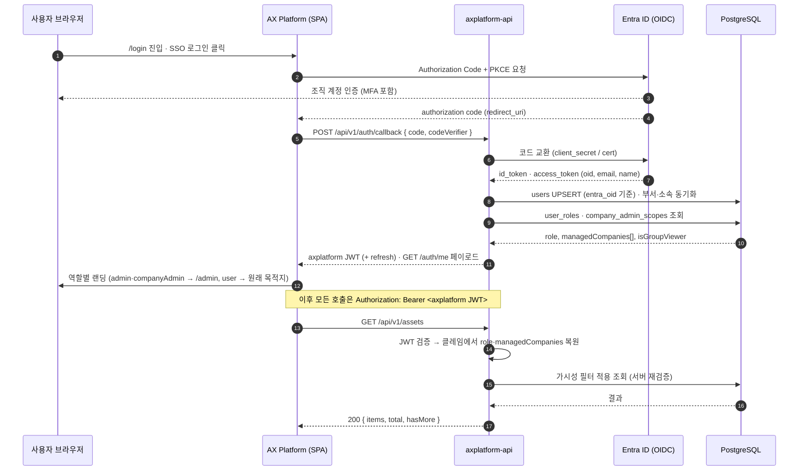
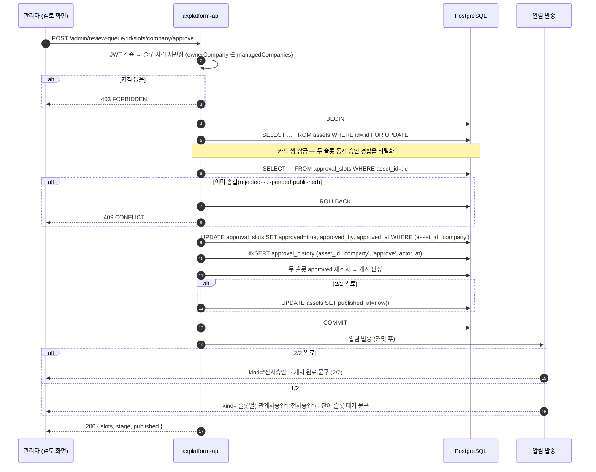

# AX Platform API·DB 명세서 (v1.1)

본 문서는 `docs/AX-Platform-화면별-기획설명서.md`(v4, 이하 **v4**)를 1순위 근거로 하고,
`frontend/src`의 목업 데이터 접근 계층(`lib/dataSource.ts`·`lib/statsDerive.ts`·`types/*`)이
드러내는 **실규격**을 2순위 근거로, `docs/screen-specs/`의 화면별 연동 서술을 3순위 근거로 삼아
백엔드 API와 데이터베이스 스키마를 규정한다.

- v4와 코드가 어긋나는 지점은 임의로 확정하지 않고 **[7장 결정 이력·잔여 항목](#7-결정-이력잔여-항목)** 에 올렸다.
- v4·코드 어디에도 근거가 없는 규격은 발명하지 않았다. 미근거 항목 역시 7장으로 보냈다.
- **v1.1에서 DN-01~DN-18 중 17건이 확정되어 본문에 반영되었다.** 잔여 결정 대기는 **DN-05(이미지 스토리지)** 한 건이다.

**확정 전제 (변경 금지)**

| 코드 | 내용 |
|---|---|
| D1 | 시스템·스키마·서비스 명명은 **axplatform** |
| D2 | 카드 리소스 정본은 **`/api/v1/assets`** (카드 = asset) |
| D3 | 인증은 **OIDC(Microsoft Entra ID) + 자체 JWT 발급**, 역할 클레임 `user` / `admin` / `companyAdmin`(+담당 관계사 배열) |
| D4 | 산출물은 단일 markdown + mermaid |

---

## 목차

1. [개요·명명 규칙](#1-개요명명-규칙)
2. [인증·권한](#2-인증권한)
3. [DB 스키마](#3-db-스키마)
4. [API 명세](#4-api-명세)
5. [통계 API 규격 · 승인 단계 매핑](#5-통계-api-규격--승인-단계-매핑)
6. [트랜잭션·정합](#6-트랜잭션정합)
7. [결정 이력·잔여 항목](#7-결정-이력잔여-항목)

---

## 1. 개요·명명 규칙

### 1.1 시스템 명명 (D1)

| 축 | 값 | 비고 |
|---|---|---|
| 시스템·제품명 | AX Platform | 사용자 노출 표기 |
| 서비스·리포지토리 식별자 | `axplatform` | 컨테이너·배포 단위 |
| DB 스키마 | `axplatform` | 단일 스키마. 테이블은 스키마 수식 없이 표기 |
| API 베이스 | `/api/v1` | 버전은 경로 세그먼트 |

### 1.2 리소스 명명 (D2)

카드(자산)의 정본 리소스는 **`/api/v1/assets`** 다. 코드 주석에 남아 있는
`GET /api/v1/platform-items` 계열 표기(`lib/dataSource.ts`, `mocks/*`의 TODO 주석)는
D2 이전의 초안이며 **본 명세서가 정본**이다.

프론트엔드 라우트 경로 문자열(`/projects`, `/admin/projects`, `/edit-request/:id` 등)은
그대로 둔다 — D2는 API 리소스 명명에만 적용된다. 카테고리 라우트(`/n8n`, `/ai-orchestration` …)도
`categories.path` 값으로 유지한다.

### 1.3 식별자·표기 규약

| 대상 | 형식 | 근거 |
|---|---|---|
| 카드 ID | `{PREFIX}-{YYYY}-{NNN}` (예: `N8N-2026-001`) | v4 §0.3, `types/categoryTypes.ts` `makeItemId` |
| 카드 ID 접두어 7종 | `N8N` `PA` `AST` `AIO` `ML` `VIBE` `ETC` | `ID_PREFIX` |
| 소식 ID | `NOTICE-{YYYY}-{NNN}` | v4 ADM-09, `types/noticeTypes.ts` |
| 카테고리 내부 id 7종 | `n8n` `pa` `assistant` `ai-orchestration` `ml` `vibe` `etc` | `CategoryId` — **임의 변경 금지** |
| 관계사 코드 | 대문자 영문 3~4자 (`KKM` `KBH` `HC` …) | `INITIAL_COMPANIES` |
| 날짜(표시·저장 문자열) | `YYYY.MM.DD` | 전 목업 공통 |
| 월키(통계 파라미터) | `YYYY-MM` | `statsDerive` `MonthRange` |
| 절감 시간 직렬화 | `"<주기> N시간"` (주기 = 일/주/월/년) | v4 §0.8, `parseTimeSaved` |

**날짜 저장형에 대한 방침**: DB는 `date` / `timestamptz` 로 저장하고, `YYYY.MM.DD`는 **표시·직렬화 형식**으로만
API 경계에서 변환한다. 단 `audit_logs`는 v4 ADM-08의 *소급 수정 금지* 요건에 따라 기록 당시 문자열
(`datetime`, 예 `"2025.06.06 09:05"`)을 원문 그대로 보존하는 컬럼을 병행한다.

### 1.4 API 공통 규약

- 표현형: `application/json; charset=utf-8`. 필드명은 camelCase(프론트 타입과 일치).
- 인증: `Authorization: Bearer <JWT>`. 공개 엔드포인트는 2.5의 표에 명시된 것만이다.
- 목록 응답 봉투: `{ "items": [...], "total": <number>, "hasMore": <boolean> }`.
  화면의 "더보기 (남은 N건)" 증분 패턴(v4 §0.11 `useVisibleCount`)이 `total`로 잔여 건수를 계산한다.
- 페이지네이션: `?limit=&offset=`. 기본 `limit`은 화면 증분 단위와 정렬한다
  (카탈로그 24 / 검토 큐 12 / 내 신청 10 / 소식·로그 10).
- 오류 봉투: `{ "error": { "code": "<CODE>", "message": "<사용자 노출 문구>", "details": {...} } }`.

**공통 오류 코드**

| HTTP | code | 의미 |
|---|---|---|
| 400 | `VALIDATION_FAILED` | 필수값 누락·형식 위반 |
| 401 | `UNAUTHENTICATED` | 토큰 없음·만료 |
| 403 | `FORBIDDEN` | 역할·범위(ownerCompany) 밖 |
| 404 | `NOT_FOUND` | 대상 없음(비노출로 가려진 경우 포함) |
| 409 | `CONFLICT` | 중복 식별자·상태 전이 충돌(승인 경합 등) |
| 422 | `RULE_VIOLATION` | 보호 장치 3종 등 도메인 규칙 위반 |
| 429 | `RATE_LIMITED` | 호출 한도 초과 |

> **비노출 처리 방침**: 권한 밖 리소스는 존재 사실 자체가 정보이므로,
> 목록에서는 필터로 제외하고 단건 조회에서는 `403`이 아닌 **`404`** 로 응답한다.
> (예: companyAdmin이 담당 밖 신청 건의 `:id`를 직접 호출한 경우)

### 1.5 용어 대응

v4 §0.2의 쉬운 치환 표준을 API 필드에 그대로 유지한다 — 내부 식별자는 코드 규격을 따르고,
사용자 노출 문구만 치환한다.

| 화면 문구 | API·DB 필드 |
|---|---|
| 외부 도구 주소 | `categories.access_url` / `assets.specific_url`(AI Model 모델 접속 URL) |
| 한 줄 설명 | `categories.short_desc` / `assets.summary` |
| 등록 부서 | `assets.dept` |
| 등록 관계사(등록 주체) | `assets.owner_company` |
| 노출 범위 | `asset_visibility_companies` |

---

## 2. 인증·권한

### 2.1 인증 방식 (D3)

Microsoft Entra ID(구 Azure AD) OIDC Authorization Code + PKCE 로 인증하고,
백엔드가 자체 JWT를 발급한다. 프론트는 자체 JWT만 사용한다.



**데모 로그인**: 현행 `LoginPage`의 데모 계정 6종과 `sessionStorage.demo_user`는
SSO 전환 시 제거한다(v4 §0.2·USR-01). 서버는 데모 계정 경로를 제공하지 않는다.

### 2.2 JWT 클레임

| 클레임 | 타입 | 설명 |
|---|---|---|
| `sub` | string | `users.id` (UUID) |
| `email` | string | 조직 이메일 |
| `name` | string | 표시 이름 |
| `dept` | string | 소속 부서명 |
| `company` | string | 본인 소속 관계사 코드 (표시용 — v4 §0.5 허용 범위) |
| `role` | `"user" \| "admin" \| "companyAdmin"` | `context/AuthContext.ts` `Role`과 동일 3값 |
| `managedCompanies` | string[] | `companyAdmin` 전용 담당 관계사 코드 배열 (복수 가능) |
| `isGroupViewer` | boolean | 그룹 전체보기 보조 플래그 |
| `exp` / `iat` | number | 만료·발급 시각 |

- 액세스 토큰 수명 60분, 리프레시 토큰 8시간(재로그인 유도)을 기준값으로 둔다.
- 권한이 변경되면(ADM-08 부여·회수) 해당 사용자의 리프레시 토큰을 무효화해 다음 갱신 시 클레임을 재발급한다.

> **클레임은 캐시일 뿐이다.** 모든 가시성·조작 판정은 요청 시점에 DB의
> `user_roles` · `company_admin_scopes`를 다시 읽어 재검증한다(v4 §0.6 서버 검증 책임).

### 2.3 권한 축 — ownerCompany 단일 축

관리 화면의 **가시성 · 승인 자격 · 삭제 권한**은 모두 `assets.owner_company` 단일 축으로 판정한다.
검토(ADM-02)·카드 관리(ADM-03)·대시보드(ADM-01)·통계(ADM-04) 판정이 동일하다.

```
inScope(asset, user) :=
    user.role == "admin"                                   → true
    user.role == "companyAdmin"                            → asset.ownerCompany ∈ user.managedCompanies
    otherwise                                              → false
```

코드 근거: `statsDerive.inScope` / `dataSource.getDashboardData.inScope` /
`AdminReview.ownsByOwnerCompany` 가 동일 판정을 수행한다.
`asset_visibility_companies`(노출 범위 `company`)는 **권한 축이 아니다** — 사용자 카탈로그의
목록 게이팅에만 쓰이는 별개 축이다(v4 §0.5).

**슬롯 자격**

| 슬롯 | 자격 | 코드 근거 |
|---|---|---|
| `company` (관계사) | `admin` 이거나, `companyAdmin` ∧ `ownerCompany ∈ managedCompanies` | `canActCompanySlot` |
| `global` (전사) | `admin` 전용 | `canActGlobalSlot` |

### 2.4 보호 장치 3종 (서버 재검증)

v4 §0.6·ADM-08 의 3종은 UI 가드와 무관하게 서버가 독립 검증하며, 위반 시 `422 RULE_VIOLATION`을 반환한다.

| # | 규칙 | 검증 시점 | `details.rule` |
|---|---|---|---|
| ① | 전사 관리자(`admin`) 최소 1명 유지 — 마지막 1명 회수 차단 | `DELETE /admin/users/:id/roles/admin` | `LAST_ADMIN` |
| ② | 본인 권한 회수 차단 (`sub == 대상 user`) | 모든 권한 회수 | `SELF_REVOKE` |
| ③ | `companyAdmin`의 담당 관계사 최소 1곳 유지 | `DELETE /admin/company-admins/:userId/companies/:code` | `LAST_MANAGED_COMPANY` |

③ 위반 시 안내 문구는 화면과 동일하게 "담당을 모두 해제하려면 권한 회수를 사용하세요"로 통일한다.
세 규칙의 판정과 `audit_logs` 기록은 **단일 트랜잭션**이다(6.4).

### 2.5 화면 접근 ↔ API 권한 대응

| 화면 | 라우트 | 접근 역할 | 대응 API 권한 |
|---|---|---|---|
| USR-00 랜딩 | `/` | 공개 | 공개 조회 API만 |
| USR-01 로그인 | `/login` | 공개 | `/auth/*` |
| USR-03 카탈로그 | `/projects` | 로그인 | `GET /assets` |
| USR-04 카드 상세 | `/{카테고리}/:itemId` | 로그인 | `GET /assets/:id` 외 |
| USR-05 등록 신청 | `/projects/new` | 로그인 | `POST /assets` (AI Model은 admin) |
| USR-06 수정 요청 | `/edit-request/:id` | 로그인 | `POST /edit-requests` (AI Model은 admin) |
| USR-07 내 현황 | `/my-status` | 로그인 | `GET /assets/mine` |
| USR-09 이용 가이드 | `/guide` | 공개 | 없음(정적) |
| USR-10 소식 | `/notices` | 공개 | `GET /notices` |
| USR-11 설정 | `/settings` | 로그인 | `PUT /me/interests` |
| ADM-01 대시보드 | `/admin` | admin·companyAdmin | `GET /admin/dashboard` |
| ADM-02 검토 | `/admin/review` | admin·companyAdmin | `GET /admin/review-queue`, 승인·반려·취소 |
| ADM-03 카드 관리 | `/admin/projects` | admin·companyAdmin | 조회·삭제는 범위 내, 수정·직접 등록은 admin |
| ADM-04 통계 | `/admin/statistics` | admin·companyAdmin | `GET /stats/*` |
| ADM-05 분류체계 | `/admin/taxonomy` | admin 전용 | `/admin/taxonomy/*` |
| ADM-06 도구 관리 | `/admin/platforms` | admin 전용 | `/admin/categories/*` |
| ADM-07 조직 | `/admin/org` | admin 전용 | `/admin/companies`, `/admin/departments` |
| ADM-08 사용자·권한 | `/admin/users` | admin 전용 | `/admin/users/*`, `/admin/logs` |
| ADM-09 공지 관리 | `/admin/notices` | admin 전용(라우트는 companyAdmin 허용) | `/admin/notices/*` 는 **admin 전용** |

> ADM-09는 화면 라우트가 companyAdmin 접근을 허용하되 화면에서 전사 전용을 안내한다(v4).
> **API는 화면과 달리 `admin` 전용으로 강제**한다 — 라우트 접근과 데이터 조작을 분리해 이중 방어한다.

---

## 3. DB 스키마

### 3.1 ERD

```mermaid
erDiagram
    companies ||--o{ departments : "소속"
    companies ||--o{ assets : "owner_company (등록 주체)"
    companies ||--o{ asset_visibility_companies : "노출 범위"
    companies ||--o{ company_admin_scopes : "담당"

    users ||--o{ user_roles : "부여"
    users ||--o{ company_admin_scopes : "담당 관계사"
    users ||--o{ assets : "submitted_by"
    users ||--o{ approval_history : "actor"
    users ||--o{ audit_logs : "actor"
    users ||--o{ asset_reviews : "author"
    users ||--o{ asset_posts : "author"
    users ||--o{ asset_likes : "liker"
    users ||--o{ scraps : "스크랩"
    users ||--|| user_interests : "관심사"
    users ||--o{ notifications : "수신"
    users ||--o{ edit_requests : "requested_by"
    users ||--o{ notices : "작성"
    users ||--o{ operation_settings : "updated_by"
    users ||--o{ asset_views : "조회 판정"
    users ||--o{ search_logs : "검색자"

    categories ||--o{ assets : "분류"
    categories ||--o{ asset_id_sequences : "연도별 순번"

    assets ||--|| approval_slots_company : "관계사 슬롯"
    assets ||--|| approval_slots_global : "전사 슬롯"
    assets ||--o{ approval_history : "이력"
    assets ||--o{ asset_tags : "자유 태그"
    assets ||--o{ asset_images : "이미지"
    assets ||--o{ asset_contacts : "담당자"
    assets ||--o| asset_model_meta : "AI Model 사양"
    assets ||--o{ asset_visibility_companies : "노출 범위"
    assets ||--o{ asset_reviews : "활용 후기"
    assets ||--o{ asset_posts : "업데이트·논의"
    assets ||--o{ asset_likes : "좋아요"
    assets ||--o{ edit_requests : "수정 요청"
    assets ||--o{ scraps : "스크랩됨"
    assets ||--o{ asset_views : "조회 판정"

    taxonomies ||--o{ taxonomy_values : "값"
    taxonomy_values ||--o{ assets : "domain·difficulty·cost_tier·ml_type"
    free_tags ||--o{ asset_tags : "집계 대상"

    asset_posts ||--o{ post_likes : "좋아요"

    companies {
        text code PK "KKM·KBH·HC …"
        text name
        boolean visible "노출 관계사 토글 (ADM-07)"
        int sort_order
    }
    departments {
        bigserial id PK
        text name
        text parent "상위 본부 · null 허용"
        text company_code FK
        text source "manual|teams|merged"
        timestamptz synced_at
    }
    users {
        uuid id PK
        text entra_oid UK "Entra ID objectId"
        text email UK
        text name
        text dept
        text title
        text company_code FK "본인 소속"
        boolean is_group_viewer
        text group_viewer_reason "부여 시 필수"
        timestamptz group_viewer_granted_at
        uuid group_viewer_granted_by FK
        timestamptz created_at
        timestamptz last_login_at
    }
    user_roles {
        bigserial id PK
        uuid user_id FK
        text role "user|admin|companyAdmin"
        timestamptz granted_at
        uuid granted_by FK
    }
    company_admin_scopes {
        bigserial id PK
        uuid user_id FK
        text company_code FK
        timestamptz granted_at
        uuid granted_by FK
    }
    categories {
        text id PK "n8n·pa·assistant·ai-orchestration·ml·vibe·etc"
        text name "표시명"
        text short_desc
        text path UK "/n8n …"
        text access_url "null 허용 = 미설정"
        text color
        text bg
        text icon "ICON_PRESETS 키"
        text id_prefix "N8N·PA·AST·AIO·ML·VIBE·ETC"
        boolean active "노출 상태 토글"
        int sort_order
    }
    asset_id_sequences {
        text category_id PK "복합 PK"
        int year PK
        int next_seq "결번 재사용 금지"
    }
    assets {
        text id PK "{PREFIX}-{YYYY}-{NNN}"
        text category_id FK
        text title
        text summary
        text description
        text dept "등록 부서"
        text owner_company FK "등록 주체 관계사 = 권한 축"
        uuid submitted_by FK
        text owner "주담당자 표시명"
        text owner_email
        text specific_url "AI Model 모델 접속 URL"
        text expected_time_saved "'<주기> N시간' 원문 보존"
        text trigger_action
        text difficulty_value "n8n 전용"
        text domain_value "업무 도메인"
        text ml_type_value "ML 전용"
        text training_data_desc
        text dev_tool
        text shared_prompt "assistant 전용"
        text based_model "assistant 전용"
        text agent_availability "AI Model 전용 · 사용 가능|사용 불가"
        jsonb workflow_def "n8n 시각화 정의"
        text workflow_json
        boolean rejected "종결 플래그"
        boolean suspended "종결 플래그"
        text rejection_reason
        timestamptz published_at "2/2 승인 시각 · null=미게시"
        date created_at "최초 신청일 · 통계 축"
        timestamptz updated_at
        bigint view_count "서버 원자 증가"
    }
    approval_slots_company {
        text asset_id PK
        text slot_key "company"
        boolean approved
        uuid approved_by FK
        timestamptz approved_at
    }
    approval_slots_global {
        text asset_id PK
        text slot_key "global"
        boolean approved
        uuid approved_by FK
        timestamptz approved_at
    }
    approval_history {
        bigserial id PK
        text asset_id FK
        text slot_key "company|global · 반려·중지는 null"
        text action "approve|reject|cancel|suspend|unsuspend"
        uuid actor_id FK
        timestamptz acted_at
        text note "반려 사유"
    }
    edit_requests {
        bigserial id PK
        text asset_id FK
        uuid requested_by FK
        text reason "필수"
        jsonb payload "변경분만 저장"
        text status "pending|applied|held|rejected"
        timestamptz created_at
        uuid processed_by FK
        timestamptz processed_at
        text process_note
    }
    asset_tags {
        text asset_id PK
        text tag PK
    }
    free_tags {
        text tag PK
        uuid proposed_by FK
        text proposer_dept
        text source_category_id FK
        timestamptz first_seen_at
    }
    taxonomies {
        text key PK "businessDomain|difficulty|costTier|mlTypes"
        text label
        text description
        text selection_type "single|multi"
    }
    taxonomy_values {
        bigserial id PK
        text taxonomy_key FK
        text value UK "복합 UK (taxonomy_key, value)"
        int sort_order
        boolean active
    }
    asset_images {
        bigserial id PK
        text asset_id FK
        text storage_key "스토리지 선정 대기 — 7장"
        int sort_order
    }
    asset_contacts {
        bigserial id PK
        text asset_id FK
        text name
        text dept
        text role "주담당자 등"
        text email
        int sort_order
    }
    asset_model_meta {
        text asset_id PK
        text provider
        text model_name
        text context_window "쉬운 표현 문자열"
        text[] strengths
        text strengths_detail
        text token_usage_note
        text cost_tier "낮음|보통|높음"
        text[] use_cases
    }
    asset_visibility_companies {
        text asset_id PK
        text company_code PK
    }
    asset_reviews {
        bigserial id PK
        text asset_id FK
        uuid author_id FK
        text body
        timestamptz created_at
        int like_count
    }
    asset_posts {
        bigserial id PK
        text asset_id FK
        uuid author_id FK
        text tag "공지|Q&A|이슈제보|건의"
        text body
        timestamptz created_at
        int like_count
    }
    asset_likes {
        text asset_id PK
        uuid user_id PK
        timestamptz created_at
    }
    post_likes {
        bigint post_id PK
        uuid user_id PK
    }
    scraps {
        uuid user_id PK
        text asset_id PK
        timestamptz created_at
    }
    asset_views {
        text asset_id PK
        uuid user_id PK
        timestamptz last_counted_at "24시간 창 판정 기준 (DN-09)"
    }
    search_logs {
        bigserial id PK
        text keyword "정규화 전 원문"
        uuid user_id FK "검색자 · 비로그인 없음"
        timestamptz searched_at
        int result_count "응답 total"
    }
    user_interests {
        uuid user_id PK
        text[] categories
        text[] domains
        timestamptz updated_at
    }
    notifications {
        bigserial id PK
        uuid user_id FK
        text kind "7종 enum"
        text title
        text body
        text asset_id "연결 카드 · null 허용"
        boolean read
        timestamptz created_at
    }
    notices {
        text id PK "NOTICE-{YYYY}-{NNN}"
        text kind "공지사항|업데이트"
        text title
        text body
        date posted_at
        boolean pinned
        boolean visible
        uuid created_by FK
        timestamptz created_at
        timestamptz updated_at
    }
    audit_logs {
        bigserial id PK
        timestamptz occurred_at
        text occurred_at_text "기록 당시 원문 · 소급 수정 금지"
        uuid actor_id FK
        text actor_name "기록 당시 표시명 스냅숏"
        text action
        text target
        text category "등록물|권한|분류체계|조직"
        text source "n8n|PA|나만의비서|AI Model|ML|Vibe"
    }
    operation_settings {
        text key PK "teamsChannelUrl 등"
        text value
        timestamptz updated_at
        uuid updated_by FK
    }
```



> **ERD 표기 주석**: `approval_slots`는 카드당 정확히 2행(`company`·`global`)을 갖는 단일 테이블
> `approval_slots(asset_id, slot_key, …)` PK`(asset_id, slot_key)` 다.
> mermaid `erDiagram`이 동일 테이블에 대한 두 개의 `||--||` 관계를 표현하지 못해
> 위 도식에서만 `approval_slots_company` / `approval_slots_global` 로 분해해 그렸다.
> **물리 테이블은 `approval_slots` 하나** 이며, 카드 생성 시 두 행을 함께 INSERT한다.

### 3.2 신청과 게시본의 단일 테이블 방침

카드 ID는 **접수 시점에 발급되고 승인 전후 불변**이며(v4 §0.3), 승인 단계는
슬롯 상태에서 파생된다(`deriveStage`). 따라서 신청 테이블과 게시본 테이블을 분리하지 않고
`assets` 단일 테이블이 전 수명주기를 보유한다.

- 게시 여부 = `published_at IS NOT NULL` (= 두 슬롯 모두 `approved`).
- 사용자 카탈로그(`GET /assets`)는 `published_at IS NOT NULL` 인 행만 노출한다.
- 검토 큐(`GET /admin/review-queue`)는 `published_at IS NULL OR 종결 플래그` 인 행을 다룬다.
- 이 방침이 v4 §0.9 ①(단일 카탈로그 SSOT에서 총량 파생)을 물리 계층에서 보장한다 — 별도 집계 테이블 없음(6.5).

**카드 ID 수명 규칙 (DN-16 확정)**

- 카드 ID는 **접수 시점에 발급되고 승인 전후 불변**이다. 승인·반려·중지 어느 전이에서도 재발급하지 않는다.
- 반려된 건을 삭제한 뒤 다시 신청하면 **새 ID를 발급**한다 — 삭제된 ID를 회수해 재사용하지 않는다.
- 따라서 삭제·롤백으로 소비된 ID는 **결번으로 영구 잔류**한다(6.2 순번 발급 정책과 동일 원칙).

### 3.3 열거값 (코드 규격 = 정본)

| 열거 | 값 | 코드 근거 |
|---|---|---|
| `categories.id` | `n8n` `pa` `assistant` `ai-orchestration` `ml` `vibe` `etc` | `CategoryId` |
| 승인 단계(파생) | `승인 대기` `부분 승인` `게시됨` `반려` `중지` | `ApprovalStage` |
| 슬롯 키 | `company` `global` | `ApprovalSlotKey` |
| 승인 액션 | `승인`(approve) `반려`(reject) `취소`(cancel) | `ApprovalRecord.action` |
| 이력 액션(DB 전용 확장) | `suspend` `unsuspend` — 프론트 타입 미대응(4.6) | DN-02 (c) |
| 업무 도메인 | `영업` `생산` `연구` `재무` `HR` `IT` | `BUSINESS_DOMAINS` |
| 구성 난이도 | `쉬움` `보통` `어려움` | n8n 전용 |
| 비용 등급 | `낮음` `보통` `높음` | AI Model 전용 |
| ML 모델 유형 | 11종 (`분류 (Classification)` … `기타`) | `ML_TYPES` |
| 알림 kind | `신청접수` `관계사승인` `전사승인` `반려` `후기등록` `게시판글` `수정요청처리` | `NotificationKind` |
| 게시글 태그 | `공지` `Q&A` `이슈제보` `건의` | `PostTag` |
| 소식 종류 | `공지사항` `업데이트` | `NoticeKind` |
| 로그 카테고리 | `등록물` `권한` `분류체계` `조직` | `LogEntry.category` |
| 부서 출처 | `manual` `teams` `merged` | `DeptSource` |
| AI Model 가용 | `사용 가능` `사용 불가` | `agentAvailability` |

**한글 열거값의 저장 방침**: 위 값들은 화면 표시값이자 코드의 리터럴 타입이다.
DB에는 **코드 리터럴 그대로** 저장하고 별도 표시 매핑 테이블을 두지 않는다 —
`deriveStage`·`APPROVAL_SLOT_LABEL` 등 프론트 규격이 이 문자열에 직접 의존하므로,
영문 코드로 치환하면 무근거 매핑 계층이 생긴다(절대 규칙 1: 내부 식별자 리네이밍 금지).
`approval_history.action`만 영문 병기(`approve|reject|cancel`)를 두어 API 요청 동사와 정렬한다.

**다국어 방침 (DN-18 확정)**: 현 시점에는 한글 리터럴 저장을 유지한다.
다국어는 **영어·중국어 한정**으로 염두에 두며, 도입 시 저장값(코드)과 표시값을 분리하는
**표시값 분리 계층**을 설계한다 — 그때까지 저장형은 위 리터럴이 정본이다.

> **운영 상태(PlatformItemStatus)는 스키마에 존재하지 않는다 — DN-01 확정.**
> v4 §0.4와 `types/categoryTypes.ts:94`가 전면 폐기를 명시하며, **운영 상태 축은 전면 폐기로 확정**되었다.
> `assets`에 상태 컬럼을 두지 않고, 상태 변경 API도 두지 않는다(부활 없음).
> `agentAvailability`(`사용 가능`/`사용 불가`)는 **AI Model 전용 별개 축**으로 존치하며,
> 폐기된 운영 상태 축과 무관하다 — 카드 전반의 운영 상태를 대신하지 않는다.

### 3.4 주요 인덱스·제약

| 테이블 | 제약·인덱스 | 목적 |
|---|---|---|
| `assets` | `PK(id)` / `idx(owner_company, published_at)` | 권한 축 필터 + 게시 게이팅 |
| `assets` | `idx(category_id, created_at)` | 카테고리별·기간별 통계 |
| `assets` | `idx(created_at)` | 월별 추이·이번 달 신규 |
| `asset_id_sequences` | `PK(category_id, year)` | ID 원자 발급(6.2) |
| `approval_slots` | `PK(asset_id, slot_key)` / `CHECK slot_key IN ('company','global')` | 카드당 2행 고정 |
| `approval_history` | `idx(asset_id, acted_at)` | 이력 시간순 렌더 |
| `asset_likes` | `PK(asset_id, user_id)` | 좋아요 멱등(PUT/DELETE) |
| `scraps` | `PK(user_id, asset_id)` | 스크랩 멱등 |
| `asset_tags` | `PK(asset_id, tag)` / `idx(tag)` | 태그 빈도 집계 |
| `taxonomy_values` | `UK(taxonomy_key, value)` | 분류 값 중복 방지 |
| `categories` | `UK(path)` / `UK(id_prefix)` | ADM-06 중복 검사 |
| `notices` | `idx(visible, pinned DESC, posted_at DESC)` | 고정 우선·최신순 |
| `user_roles` | `UK(user_id, role)` | 역할 중복 부여 방지 |
| `company_admin_scopes` | `UK(user_id, company_code)` | 담당 중복 방지 |
| `audit_logs` | `idx(occurred_at DESC)` / `idx(category)` | 로그 탭 필터 |
| `asset_views` | `PK(asset_id, user_id)` | 조회 24시간 중복 방지(6.5) |
| `search_logs` | `idx(searched_at DESC)` / `idx(keyword)` | 검색 로그 조회·키워드 집계 |

**참조 무결성 정책**

| 관계 | ON DELETE | 근거 |
|---|---|---|
| `assets.category_id → categories.id` | `RESTRICT` | ADM-06은 삭제보다 비활성화 권장 — 참조 보존 |
| `assets.owner_company → companies.code` | `RESTRICT` | 관계사 비노출 전환 시에도 데이터 유지(v4 ADM-07) |
| `assets.domain_value` 등 분류 참조 | **공란 처리** (`SET NULL` 상당) | v4 ADM-05: 고정 분류 삭제 시 기존 카드는 공란 처리 |
| `asset_*` 자식 테이블 → `assets.id` | `CASCADE` | 카드 삭제 시 부속 데이터 동반 삭제 |
| `audit_logs.actor_id → users.id` | `SET NULL` | 감사 기록은 사용자 삭제와 무관하게 보존(`actor_name` 스냅숏) |
| `departments.company_code → companies.code` | `RESTRICT` | 조직 축 보존 |
| `search_logs.user_id → users.id` | `SET NULL` | 검색 통계는 사용자 삭제와 무관하게 보존(DN-12) |

> 분류 참조를 FK로 걸지 않고 `assets.domain_value` 등 **텍스트 값**으로 둔 것은
> ADM-05의 "삭제 시 공란 처리" 정책을 단순하게 만들기 위함이다.
> 값 유효성은 애플리케이션 계층이 `taxonomy_values`와 대조해 검증한다.

---

## 4. API 명세

권한 열 표기: `공개` / `로그인` / `본인` / `admin` / `companyAdmin*`(= 담당 범위 내) / `admin+companyAdmin*`.

### 4.1 인증 `/api/v1/auth`

| 메서드·경로 | 권한 | 요청 | 응답 | 오류 |
|---|---|---|---|---|
| `GET /auth/login-url` | 공개 | `?redirectUri=` | `{ authorizeUrl, state }` | — |
| `POST /auth/callback` | 공개 | `{ code, codeVerifier, state }` | `{ accessToken, refreshToken, user }` | 400 `VALIDATION_FAILED` |
| `POST /auth/refresh` | 공개 | `{ refreshToken }` | `{ accessToken, refreshToken }` | 401 `UNAUTHENTICATED` |
| `POST /auth/logout` | 로그인 | — | `204` | — |
| `GET /auth/me` | 로그인 | — | `{ id, name, email, dept, title, company, role, managedCompanies[], isGroupViewer }` | 401 |

`GET /auth/me`가 현행 `getManagedCompanies(email)`·`AuthContext`를 대체한다(v4 USR-01).

### 4.2 카드 (자산) `/api/v1/assets` — D2 정본

| 메서드·경로 | 권한 | 요청 | 응답 | 오류 |
|---|---|---|---|---|
| `GET /assets` | 로그인 | `?q=&category=&domain=&tag=&scrap=&sort=latest\|popular\|name&limit=&offset=` | `{ items: Asset[], total, hasMore }` | 401 |
| `GET /assets/:id` | 로그인 | — | `Asset` (상세 전 필드) | 404 |
| `POST /assets` | 로그인 (AI Model은 `admin`) | `AssetCreate` (아래) | `201 { id, … }` — 서버 발급 ID | 400, 403 `AI_MODEL_ADMIN_ONLY` |
| `PATCH /assets/:id` | `admin` | 변경 필드만 | `200 Asset` | 403, 404 |
| `DELETE /assets/:id` | `admin` + `companyAdmin*` | — | `204` | 403, 404 |
| `GET /assets/mine` | 본인 | `?stage=&limit=&offset=` | `{ items: MyApplication[], total, hasMore }` | 401 |
| `POST /assets/:id/view` | 로그인 | — | `204` (조회수 원자 증가) | 404 |
| `GET /assets/:id/workflow` | 로그인 | — | `{ workflowJson }` (미보유 시 폴백) | 404 |

**`GET /assets` 게이팅** (v4 USR-03·§0.5)

1. `published_at IS NOT NULL` 인 카드만.
2. 카드에 `asset_visibility_companies` 행이 있으면 → 해당 관계사 중 `companies.visible = true` 인 곳이
   요청자의 소속(`company`)에 포함될 때만 노출. 행이 없으면 전사 공용.
3. `isGroupViewer = true` 이면 2를 우회하고 전량 열람 — 응답에 `groupViewerBypass: true` 를 실어
   화면 상단 안내 뱃지의 근거로 삼는다.
4. 응답에는 `ownerCompany`를 **제공하되**, 사용자 화면은 렌더하지 않는다(v4 §0.5).
5. 카드의 `category_id`가 **비활성 카테고리**(`categories.active = false`)면 목록에서 제외한다(4.11 · DN-06).

> **`audiences` 필드는 폐기 확정이다 — DN-07.** 접근 제어 축으로 전환하지 않으므로
> 위 게이팅 규칙(`asset_visibility_companies` + `isGroupViewer` 단일 계층)의 **재설계는 불요**하다.
> 중첩 게이팅 계층을 도입하지 않는다.

**`q` 검색 범위 (DN-12 확정)**

`GET /assets?q=` 는 **제목(`title`) · 상세 설명(`description`) · 부서(`dept`)** 세 축을 대상으로 한다.
초판의 제목·요약 축에 **내용 축(`description`)** 을 추가한 것이며, 대소문자 무시 부분 일치다.

- 검색 실행 시 서버는 `search_logs`에 **키워드 · 검색자 · 시각 · 결과 수**를 기록한다(3.1).
- 결과 수는 게이팅 적용 **후** 의 `total` 값이다 — 검색자가 실제로 본 건수를 기록한다.
- `q`가 공백이거나 없으면 기록하지 않는다.
- `/stats/*` 에는 여전히 **키워드 축을 두지 않는다**(5.2) — `search_logs`는 적재만 하고
  집계 엔드포인트는 백로그다.

> **각주 — 결정 대기**: `search_logs`의 **보존 기간**은 운영 결정 사항이다.
> 개인정보 취급 방침 확정 시 보존 기간·익명화 시점을 함께 정한다.

**`AssetCreate` 요청 본문** (USR-05)

```jsonc
{
  "categoryId": "n8n",              // 필수 · AI Model(ai-orchestration)은 admin만 허용
  "title": "…", "summary": "…", "description": "…",
  "domain": "재무",                  // taxonomy businessDomain
  "tags": ["정산", "구매자동화"],     // 자유 입력 허용 → free_tags 누적
  "images": ["<storageKey>", "…"],  // 최대 10 · 스토리지 선정 대기(DN-05)
  "expectedTimeSaved": "월 4시간",   // "<주기> N시간" 직렬화(v4 §0.8)
  "contacts": [{ "name": "…", "dept": "…", "role": "주담당자", "email": "…" }],
  "difficulty": "보통",              // n8n 전용
  "workflowJson": "…",              // n8n 전용
  "sharedPrompt": "…", "basedModel": "…",          // assistant 전용
  "modelMeta": { "provider": "…", "costTier": "보통", "…": "…" },  // AI Model 전용
  "mlType": "이미지 인식", "trainingDataDesc": "…"  // ML 전용
}
```

- **노출 범위(`company`)를 요청 본문에 포함하지 않는다** — 신규 카드는 전사 공용(v4 §0.9 ③·USR-05).
  서버는 해당 키를 수신하면 무시하지 않고 `400 VALIDATION_FAILED`로 거절해 규격을 강제한다.
- 서버는 `owner_company`를 요청자의 `company` 클레임에서 채운다 — 클라이언트 지정 불가.
- 접수 성공 시 `신청접수` 알림을 발송한다(6.3).

### 4.3 상세 소통 — 좋아요·후기·게시글

| 메서드·경로 | 권한 | 요청 | 응답 | 오류 |
|---|---|---|---|---|
| `PUT /assets/:id/like` | 로그인 | — | `200 { likes }` **멱등** | 404 |
| `DELETE /assets/:id/like` | 로그인 | — | `200 { likes }` **멱등** | 404 |
| `GET /assets/:id/reviews` | 로그인 | `?limit=&offset=` | `{ items: Review[], total, hasMore }` | 404 |
| `POST /assets/:id/reviews` | 로그인 | `{ body }` | `201 Review` → `후기등록` 알림 | 400, 404 |
| `GET /assets/:id/posts` | 로그인 | `?limit=&offset=` | `{ items: Post[], total, hasMore }` | 404 |
| `POST /assets/:id/posts` | 로그인 | `{ tag, body }` | `201 Post` → `게시판글` 알림 | 400, 404 |
| `PUT /posts/:postId/like` | 로그인 | — | `200 { likes }` 멱등 | 404 |
| `DELETE /posts/:postId/like` | 로그인 | — | `200 { likes }` 멱등 | 404 |
| `GET /reviews/mine` | 본인 | `?limit=&offset=` | `{ items, total, hasMore }` | 401 |

좋아요의 멱등성은 `asset_likes` PK`(asset_id, user_id)`의 `INSERT … ON CONFLICT DO NOTHING` /
`DELETE`로 보장한다(v4 §0.10 "scraps PUT/DELETE 멱등"과 동일 방식).

### 4.4 수정 요청 `/api/v1/edit-requests`

| 메서드·경로 | 권한 | 요청 | 응답 | 오류 |
|---|---|---|---|---|
| `POST /edit-requests` | **로그인 — 단, 대상이 AI Model 카드면 `admin` 전용** | `{ assetId, reason, payload }` | `201 EditRequest` | 400 `REASON_REQUIRED`, 403 `AI_MODEL_ADMIN_ONLY`, 404 |
| `GET /admin/edit-requests` | `admin` + `companyAdmin*` | `?status=&limit=&offset=` | `{ items, total, hasMore }` | 403 |
| `GET /admin/edit-requests/:id` | `admin` + `companyAdmin*` | — | `EditRequest` | 403, 404 |
| `PATCH /admin/edit-requests/:id` | `admin` + `companyAdmin*` | `{ status: "applied"\|"held"\|"rejected", note }` | `200 EditRequest` → `수정요청처리` 알림 | 400, 403, 404 |

**신청 자격 규칙** (v4 USR-04·USR-06·§0.6 · **DN-03 확정**)

> 게시된 카드에 대해 **로그인 사용자 누구나** 수정 요청을 신청할 수 있다 — 담당자 변경·이관처럼
> 제3자가 발견하는 수정 사유가 실무에 많다는 판단이 근거다. **v4 정본을 그대로 유지한다.**
> **예외: 대상 카드가 AI Model(`ai-orchestration`)이면 `admin` 전용**이다(v4 §0.6, 등록 제한과 동일 원칙).

**화면 노출 방식도 현행 유지로 확정한다.** 상세 화면(USR-04)의 "수정 요청" 버튼은
AI Model 카드에서도 **전원에게 노출**하고, 진입 후 `EditRequestPage`가 비관리자에게
**관리자 전용 안내 화면**을 보여 차단한다(`EditRequestPage.tsx:228-240`). 버튼을 사전에
숨기거나 비활성화하지 않는다 — 예외의 존재 자체를 알리는 편이 안내 비용이 낮다는 판단이다.

> 화면정의서 USR-04 룰 문구에 이 AI Model 예외를 병기하는 작업은 **SPEC-AMEND 소관**이며
> 본 명세서의 범위가 아니다. API 규격은 위 표의 권한 열이 정본이다.

- `reason`은 필수다. 공백만 있는 값도 `400 REASON_REQUIRED`.
- `payload`는 **변경분만** 담는다(v4 §0.2 "diff → 변경분만 저장").
- 요청 본문에 `company`(노출 범위)를 포함하지 않는다(v4 §0.9 ③·USR-06).
- 대상은 `published_at IS NOT NULL` 인 카드로 한정한다.

**처리 권한·큐 화면 (DN-10 확정)**

- 처리(`PATCH /admin/edit-requests/:id`) 권한은 **`admin` + 담당 범위 내 `companyAdmin*`** 으로 확정한다
  (4.4 표의 잠정안을 그대로 채택). 범위 판정은 대상 카드의 `owner_company` 기준(2.3)이다.
- 관리자 처리 큐 **화면**은 미구현이며 API 규격만 선확보한다 — **화면 도입 시점은 백로그 유지**(v4 부록 B·USR-06).
- 관리자가 신규 수정 요청을 인지하는 경로는 **관리자 화면**이다 — ADM-01 대시보드의
  "수정 요청 대기" 위젯(4.7)과 위 처리 큐 API가 담당한다. **관리자 수신용 알림 kind는 신설하지 않는다**(6.3).

### 4.5 검토·승인 `/api/v1/admin/review-queue`

| 메서드·경로 | 권한 | 요청 | 응답 | 오류 |
|---|---|---|---|---|
| `GET /admin/review-queue` | `admin` + `companyAdmin*` | `?stage=&category=&limit=&offset=` | `{ items: ReviewItem[], total, hasMore, counts }` | 403 |
| `GET /admin/review-queue/:id` | `admin` + `companyAdmin*` | — | `ReviewItem` (이력 포함) | 403, 404 |
| `PATCH /admin/review-queue/:id` | 슬롯 자격 보유자 | 편집 필드 | `200 ReviewItem` | 403, 404 |
| `POST /admin/review-queue/:id/slots/:slotKey/approve` | `company`: `admin`·`companyAdmin*` / `global`: `admin` | — | `200 { slots, stage, published }` | 403, 409 `SLOT_CONFLICT` |
| `POST /admin/review-queue/:id/slots/:slotKey/cancel` | 동일 (본인 승인 슬롯) | — | `200 { slots, stage }` | 403 `NOT_SLOT_OWNER`, 409 `ALREADY_PUBLISHED` |
| `POST /admin/review-queue/:id/reject` | 어느 슬롯이든 자격 보유자 | `{ reason }` (필수) | `200 { stage: "반려" }` | 400 `REASON_REQUIRED`, 403 |

**규칙**

- `counts`는 화면 요약 칩의 소스다 — 형태와 집계 기준은 5.3 참조.
- 승인 취소(`cancel`)는 **게시 전(부분 승인)** 이고 **본인이 승인한 슬롯**에 한한다.
  이미 게시된 건(`published_at IS NOT NULL`)에는 `409 ALREADY_PUBLISHED`.
- 반려는 사유가 필수이며 **어느 슬롯 자격자든** 가능하고, 사유는 신청자에게 그대로 전달된다.
- 승인·취소·반려는 **슬롯 갱신 + 이력 기록 + 게시 판정이 단일 트랜잭션**이며 각각 알림을 발송한다(6.1·6.3).
- `companyScope`가 미지정(`unset`)인 항목은 승인 불가(코드 `approveSlot` 가드와 동일).

### 4.6 카드 관리 `/api/v1/admin/assets`

| 메서드·경로 | 권한 | 요청 | 응답 | 오류 |
|---|---|---|---|---|
| `GET /admin/assets` | `admin` + `companyAdmin*` | `?q=&category=&limit=&offset=` | `{ items: ManagedAsset[], total, hasMore }` | 403 |
| `GET /admin/assets/:id` | `admin` + `companyAdmin*` | — | `ManagedAsset` | 403, 404 |
| `POST /admin/assets` | `admin` | `AssetCreate` (직접 등록) | `201` — ID 발급 규칙 동일 | 403 |
| `PATCH /admin/assets/:id` | `admin` | 변경 필드 | `200` | 403, 404 |
| `DELETE /admin/assets/:id` | `admin` + `companyAdmin*` | `{ reason }` | `204` (복구 불가) | 403, 404 |
| `POST /admin/assets/:id/images` | `admin` | multipart | `201 { storageKey }` | 403, 413 |
| `DELETE /admin/assets/:id/images/:imageId` | `admin` | — | `204` | 403, 404 |
| `POST /admin/assets/:id/suspend` | **`admin` 전용** | `{ reason }` (필수) | `200 { stage: "중지" }` | 400 `REASON_REQUIRED`, 403, 404, 409 `NOT_PUBLISHED` |
| `POST /admin/assets/:id/unsuspend` | **`admin` 전용** | `{ reason }` (필수) | `200 { stage }` — 슬롯 재파생 | 400 `REASON_REQUIRED`, 403, 404, 409 `NOT_SUSPENDED` |

권한 세분(v4 ADM-03): **수정·직접 등록은 admin 전용**, **삭제는 담당 범위 내 companyAdmin에게도 허용**.
가시성은 검토 화면과 동일한 `ownerCompany` 판정이다.

**중지 전이 (DN-02 (c) 확정)**

`중지`(`assets.suspended`)로 전이시키는 조작이 코드·명세 양쪽에 부재했던 공백을 위 두 엔드포인트로 메운다.

| 항목 | 규정 |
|---|---|
| 권한 | **`admin` 전용** — 게시된 카드를 전사 차원에서 내리는 조작이므로 companyAdmin에게 열지 않는다 |
| 대상 | **게시 카드**(`published_at IS NOT NULL`)에 한한다. 미게시 건은 `409 NOT_PUBLISHED` — 미게시 건의 종결은 반려(4.5)다 |
| 사유 | **필수**. 공백만 있는 값도 `400 REASON_REQUIRED` |
| 이력 | `approval_history`에 `action='suspend'`\|`'unsuspend'`, `slot_key=null`, `note`=사유로 append |
| 트랜잭션 | `suspended` 플래그 갱신 + 이력 기록을 **단일 트랜잭션**으로 처리한다(6.1과 동일 구조) |
| 알림 | **신청자**(`assets.submitted_by`)가 수신한다 — 커밋 이후 발송(6.3) |
| 게시 상태 | `unsuspend`는 `suspended=false`로 되돌릴 뿐이며 `published_at`을 건드리지 않는다 → `deriveStage`가 슬롯에서 `게시됨`을 재파생한다 |

- `approval_history.action` 열거에 `suspend`·`unsuspend` 2값이 추가된다(3.1 주석의 `approve|reject|cancel` 확장).
- **화면 도입은 백로그다.** ADM-03 카드 관리에 조작 진입점을 두는 안이 유력하나 시점은 미정이며,
  **본 결정으로 인한 프론트엔드 변경은 없다** — API 규격만 선확보한다.

### 4.7 대시보드 `/api/v1/admin/dashboard`

| 메서드·경로 | 권한 | 요청 | 응답 |
|---|---|---|---|
| `GET /admin/dashboard` | `admin` + `companyAdmin*` | `?company=` | 아래 페이로드 |
| `GET /admin/recent-activity` | `admin` + `companyAdmin*` | `?company=&limit=` | `{ items: ActivityItem[] }` |

```jsonc
{
  "companies": ["KKM", "KBH"],       // 범위 내 등장 관계사
  "activeTools": 50,                  // 총 카드 수 (누적 · 전 기간)
  "newThisMonth": 4,                  // 당월 실측
  "pending": [ { "id":"N8N-2026-014", "title":"…", "dept":"…", "submittedAt":"2026.06.20",
                 "type":"n8n", "source":"n8n", "company":"KKM",
                 "stage":"승인 대기", "approvalSlots": { "company": {...}, "global": {...} } } ],
  "partialCount": 2,                  // 부분 승인 건수(병기)
  "pendingEditRequests": 0,           // 수정 요청 대기 = status='pending' 단독(DN-04)
  "recentApproved": [ { "id":"…", "title":"…", "dept":"…", "approvedAt":"…", "source":"n8n" } ],
  "recentActivity": [ { "activity":"review", "itemId":"…", "itemTitle":"…",
                        "source":"n8n", "author":"…", "dept":"…", "date":"2026.06.20" } ],
  "reviewTotal": 37
}
```

- **기간 파라미터가 없다** — 대시보드는 고정 스냅숏이다(v4 ADM-01 "기간 필터를 두지 않는다").
  현행 `getDashboardData(scope, range)`의 `range`는 등록 추이 위젯 전용 잔재이며,
  대시보드에서 분석성 차트가 통계로 일원화된 이상 서버 규격에는 두지 않는다.
- `companyAdmin`은 `?company=`를 지정하더라도 서버가 `managedCompanies`와 교집합을 취한다.
- 사이드바 승인 대기 건수는 조회 범위와 무관하게 **본인 권한 기준**(baseScope)으로 계산한다(v4 PART 2 공통).
  → `GET /admin/pending-count` 를 별도로 두지 않고 `GET /auth/me` 응답에 `pendingCount`를 포함한다.

**`pendingEditRequests` 판정 기준 (DN-04 확정)**

- **`edit_requests.status = 'pending'` 단독**이다. `held`(보류)는 **관리자가 이미 판단을 내린 상태**이므로
  대기 건수에 포함하지 않는다. `applied`·`rejected`도 당연히 제외된다.
- 범위는 대시보드 조회 범위와 동일하다 — 대상 카드의 `owner_company`가 `?company=` ∩ `managedCompanies` 안에 드는 건만 센다.
- 위젯 클릭 시 이동 대상은 4.4의 처리 큐 API를 소비하는 화면이며, 그 **화면 도입 시점은 백로그**다(DN-10).

> **현행 `AdminDashboard.tsx:166`의 하드코딩 `0`은 목업 잔재다.**
> 수정 요청 데이터 모델·목업이 없어 상수로 두었을 뿐이며,
> **서버 연동 시 삭제하고 `pendingEditRequests` 응답 값으로 대체할 대상**이다.

### 4.8 조직 `/api/v1/admin` (ADM-07)

| 메서드·경로 | 권한 | 요청 | 응답 | 오류 |
|---|---|---|---|---|
| `GET /admin/companies` | `admin` | `?visible=` | `{ items: Company[] }` (`code, name, visible, assetCount`) | 403 |
| `PATCH /admin/companies/:code` | `admin` | `{ visible }` | `200 Company` | 403, 404 |
| `GET /admin/departments` | `admin` | `?company=` | `{ items: Dept[] }` | 403 |
| `POST /admin/departments` | `admin` | `{ name, parent, companyCode }` | `201` | 409 `DUPLICATE_DEPT` |
| `PATCH /admin/departments/:id` | `admin` | `{ name, parent }` | `200` | 404 |
| `DELETE /admin/departments/:id` | `admin` | — | `204` (+ `taggedAssetCount` 경고 선조회) | 404 |
| `GET /admin/departments/:id/impact` | `admin` | — | `{ taggedAssetCount }` | 404 |
| `GET /admin/teams/org-preview` | `admin` | — | `{ items: [{ name, parent, company, status: "new"\|"merged" }] }` | 403 |
| `POST /admin/teams/sync` | `admin` | — | `202 { added, merged }` | 403 |
| `GET /admin/settings` | `admin` | — | `{ teamsChannelUrl, teamsSync: { tenantId, autoSync, intervalHours } }` | 403 |
| `PUT /admin/settings` | `admin` | 동일 형태 | `200` | 400 `INVALID_URL` |

- 관계사를 비노출로 전환해도 데이터는 삭제되지 않는다(v4 ADM-07) — `visible` 플래그만 변경.
- 노출 토글은 `GET /assets` 게이팅과 즉시 정합해야 한다(6.6 캐시 무효화).
- 관계사 관리자 지정·해제는 이 영역에 두지 않는다 — 4.10(ADM-08) 단일 지점이다.

**부서 동기화 실행 모델 (DN-15 확정)**: `POST /admin/teams/sync`는 **`202 Accepted` 비동기**로 확정한다.
잠정 표기를 그대로 추인한 것이며, 요청은 즉시 접수 응답을 반환하고 동기화는 백그라운드에서 수행한다.
`GET /admin/teams/org-preview`가 반영 결과 확인 경로다.

### 4.9 분류체계 `/api/v1/admin/taxonomy` (ADM-05)

| 메서드·경로 | 권한 | 요청 | 응답 | 오류 |
|---|---|---|---|---|
| `GET /admin/taxonomy` | `admin` | `?scope=platform` | `{ businessDomain: {…}, difficulty: {…}, costTier: {…}, mlTypes: {…} }` | 403 |
| `POST /admin/taxonomy/:key/values` | `admin` | `{ value }` | `201` | 409 `DUPLICATE_VALUE` |
| `PATCH /admin/taxonomy/:key/values/:id` | `admin` | `{ value, sortOrder, active }` | `200` | 404 |
| `DELETE /admin/taxonomy/:key/values/:id` | `admin` | — | `204` — 참조 카드는 **공란 처리** | 404 |
| `GET /admin/taxonomy/:key/values/:id/usage` | `admin` | — | `{ assetCount }` | 404 |
| `GET /admin/taxonomy/free-tags` | `admin` | `?category=&limit=&offset=` | `{ items: FreeTag[], total, hasMore }` | 403 |
| `DELETE /admin/taxonomy/free-tags/:tag` | `admin` | — | `204` (카드의 태그 참조 동반 제거) | 404 |
| `POST /admin/taxonomy/free-tags/:tag/promote` | `admin` | `{ targetKey: "costTier"\|"mlTypes" }` | `200 { value, movedAssets }` | 422 `PROMOTION_NOT_ALLOWED` |

**편입(promote) 제한** (v4 ADM-05): 대응 입력 축이 있는 조합만 허용한다 —
`AI Model 태그 → costTier`, `ML 태그 → mlTypes`. 그 외 조합은 `422 PROMOTION_NOT_ALLOWED`.
편입은 태그 → 분류 값 전환과 카드 참조 갱신을 **단일 트랜잭션**으로 처리한다.

`FreeTag.count`는 저장 컬럼이 아니라 `asset_tags` 집계 파생값이다(6.5 단일 소스 원칙).

### 4.10 사용자·권한·로그 `/api/v1/admin` (ADM-08)

| 메서드·경로 | 권한 | 요청 | 응답 | 오류 |
|---|---|---|---|---|
| `GET /admin/users` | `admin` | `?role=admin\|companyAdmin&permission=group_viewer` | `{ items: Admin[] }` | 403 |
| `GET /admin/sso-search` | `admin` | `?q=` | `{ items: SsoUser[] }` (Entra 디렉터리) | 403 |
| `POST /admin/users/:id/roles` | `admin` | `{ role, managedCompanies? }` | `201` | 400, 422 |
| `DELETE /admin/users/:id/roles/:role` | `admin` | — | `204` | **422 `LAST_ADMIN` / `SELF_REVOKE`** |
| `GET /admin/company-admins` | `admin` | — | `{ items: [{ userId, email, name, dept, managedCompanies[] }] }` | 403 |
| `POST /admin/company-admins/:userId/companies` | `admin` | `{ code }` | `201` | 404, 409 |
| `DELETE /admin/company-admins/:userId/companies/:code` | `admin` | — | `204` | **422 `LAST_MANAGED_COMPANY`** |
| `POST /admin/users/:id/group-viewer` | `admin` | `{ reason }` (필수) | `201` | 400 `REASON_REQUIRED` |
| `DELETE /admin/users/:id/group-viewer` | `admin` | — | `204` | 404 |
| `GET /admin/registrants` | `admin` | `?limit=&offset=` | `{ items: Registrant[], total, hasMore }` | 403 |
| `GET /admin/logs` | `admin` | `?category=&q=&limit=&offset=` | `{ items: LogEntry[], total, hasMore }` | 403 |

- 권한 부여·회수·그룹 전체보기 변경은 **모두 `audit_logs`에 기록**되며 권한 변경과 단일 트랜잭션이다.
- `audit_logs`에는 갱신·삭제 엔드포인트를 두지 않는다 — 소급 수정 금지(v4 ADM-08 감사 무결성).
- `GET /admin/companies?visible=true` 는 담당 관계사 선택 대상(현행 `SELECTABLE_COMPANIES`)을 겸한다.

### 4.11 카테고리 마스터 `/api/v1/admin/categories` (ADM-06)

| 메서드·경로 | 권한 | 요청 | 응답 | 오류 |
|---|---|---|---|---|
| `GET /categories` | 공개 | — | `{ items: Category[] }` (`active=true`만) | — |
| `GET /admin/categories` | `admin` | — | `{ items: Category[] }` (비활성 포함) | 403 |
| `POST /admin/categories` | `admin` | `{ id, name, shortDesc, path, accessUrl, color, bg, icon, idPrefix }` | `201` | 409 `DUPLICATE_ID` / `DUPLICATE_PATH` |
| `PATCH /admin/categories/:id` | `admin` | `id` **제외** 전 필드 | `200` | 400 `ID_IMMUTABLE`, 404 |
| `PATCH /admin/categories/:id/active` | `admin` | `{ active }` | `200` | 404 |
| `DELETE /admin/categories/:id` | `admin` | — | `204` | **409 `CATEGORY_IN_USE`** |
| `GET /admin/icon-presets` | `admin` | — | `{ items: [{ key, label, path }] }` (`ICON_PRESETS`) | 403 |

- **내부 식별자(`id`)는 생성 후 변경 불가** (v4 ADM-06 · 절대 규칙 1). `PATCH`에 `id`가 오면 `400 ID_IMMUTABLE`.
- `id` 형식 검증: 소문자·숫자·하이픈 (`^[a-z0-9-]+$`). `path`·`id`·`idPrefix` 중복 검사 필수.
- `accessUrl`은 `null` 허용 = "미설정" 표기.
- 참조 카드가 있는 카테고리는 삭제 불가(`409`) — 비활성화를 권장한다.

**비활성 카테고리 정책 (DN-06 확정)**

`categories.active = false` 로 전환해도 데이터는 삭제되지 않으며, 축별로 다음과 같이 처리한다.

| 축 | 비활성 카테고리 처리 |
|---|---|
| **신규 등록** | **차단**. `POST /assets`·`POST /admin/assets`에 비활성 `categoryId`가 오면 `422 CATEGORY_INACTIVE` |
| **통계 집계** (`/stats/*`) | **제외** — 해당 카드를 카운트하지 않는다(5.1 집계 규칙) |
| **랜딩 플랫폼 현황** (`/stats/summary`) | **제외** — `totalAssets`·`byCategory` 모두에서 빠진다 |
| **카테고리 필터·목록** (`GET /assets`, `GET /categories`) | **제외** — 필터 선택지에서도, 목록 결과에서도 빠진다 |
| **기존 게시 카드의 직접 열람** | **유지** — `GET /assets/:id`는 정상 응답한다. URL 직접 진입·알림 링크·스크랩 경로가 깨지지 않는다 |
| **관리자 화면** (ADM-03 카드 관리 · ADM-02 검토) | **전부 표시** — `GET /admin/assets`·`GET /admin/review-queue`는 카테고리 활성 여부로 필터하지 않는다 |

> 요지: **집계·탐색 동선에서는 사라지되 이미 발급된 링크는 살아 있고, 관리자에게는 전부 보인다.**
> 비활성화는 "새로 늘리지 않고 조용히 접는" 조작이지 데이터 은폐가 아니다.

**`accessUrl` 소비 지점 (DN-11 확정)**

`categories.access_url`을 사용자 화면에서 소비하는 지점을 **USR-03 카탈로그 한 곳으로 확정**한다.

- 위치: **카테고리 필터가 활성화되었을 때** 결과 수 표시 행의 **우측**.
- 형태: `외부 도구 바로가기 ↗` 버튼 — **새 탭**으로 연다(`target="_blank"`).
- 표시 조건: 선택된 카테고리의 `accessUrl`이 설정된 경우에만. **미설정(`null`) 카테고리에서는 미표시**한다.
- 카테고리 필터가 비활성(전체 보기)이면 표시하지 않는다 — 대상 카테고리가 특정되지 않기 때문이다.

> **화면 구현은 백로그다.** 본 명세서는 소비 지점만 확정하며, API 규격(`GET /categories`의 `accessUrl`)은 이미 확보되어 있다.

### 4.12 소식 `/api/v1/notices` (USR-10 · ADM-09)

| 메서드·경로 | 권한 | 요청 | 응답 | 오류 |
|---|---|---|---|---|
| `GET /notices` | **공개** | `?kind=&limit=&offset=` | `{ items: Notice[], total, hasMore }` — `visible=true`만, 고정 우선·최신순 | — |
| `GET /admin/notices` | `admin` | `?kind=&limit=&offset=` | 비노출 포함 전체 | 403 |
| `POST /admin/notices` | `admin` | `{ kind, title, body, postedAt, pinned, visible }` | `201` — `NOTICE-{YYYY}-{NNN}` 서버 발급 | 400, 403 |
| `PUT /admin/notices/:id` | `admin` | 동일 | `200` | 403, 404 |
| `PATCH /admin/notices/:id` | `admin` | `{ pinned?, visible? }` | `200` | 403, 404 |
| `DELETE /admin/notices/:id` | `admin` | — | `204` | 403, 404 |

- `postedAt`은 `YYYY.MM.DD` 형식 검증.
- 정렬은 `pinned DESC, posted_at DESC` 고정.
- **소식은 알림을 발생시키지 않는다**(v4 §0.10·ADM-09) — `POST /admin/notices`는 어떤 알림도 트리거하지 않는다.
- ADM-09 라우트는 companyAdmin 접근을 허용하나 **API는 admin 전용**이다(2.5 주석).

### 4.13 개인화 `/api/v1/me` · 알림

| 메서드·경로 | 권한 | 요청 | 응답 | 비고 |
|---|---|---|---|---|
| `GET /me/scraps` | 본인 | — | `{ items: string[] }` (assetId 배열) | `ax_scraps` 대체 |
| `PUT /me/scraps/:assetId` | 본인 | — | `204` **멱등** | |
| `DELETE /me/scraps/:assetId` | 본인 | — | `204` **멱등** | |
| `GET /me/interests` | 본인 | — | `{ categories: string[], domains: string[] }` | `ax_user_interests` 대체 |
| `PUT /me/interests` | 본인 | `{ categories, domains }` | `200` | USR-11 저장 |
| `GET /me/recent-viewed` | 본인 | — | `{ items: string[] }` (상위 10) | `ax_recent_viewed` 대체 |
| `GET /notifications` | 본인 | `?limit=&offset=` | `{ items: AxNotification[], total, unread }` | |
| `PATCH /notifications/:id` | 본인 | `{ read: true }` | `200` | |
| `PATCH /notifications/read-all` | 본인 | — | `204` | 드롭다운 "전체 읽음" |

- 알림 범위는 **본인 신청·활동 통지 한정**이다(v4 §0.10·부록 A-3). 공지는 알림을 발생시키지 않는다.
- 발송 트리거는 전부 서버 책임: 신청 접수 · 슬롯 승인(관계사/전사) · 반려 · 승인 취소 · 수정 요청 처리 · 후기 등록 · 게시판 글.
- 알림 클릭 시 이동 경로는 `itemId` 접두어에서 파생한다(`detailPathForItemId`) — 서버는 경로를 내려보내지 않는다.

### 4.14 공개 조회

| 메서드·경로 | 권한 | 응답 | 비고 |
|---|---|---|---|
| `GET /categories` | 공개 | 카테고리 7종 | 랜딩 타일·목록 필터 |
| `GET /notices` | 공개 | 노출 소식 | 랜딩 최신소식·USR-10 |
| `GET /stats/summary` | 공개 | `{ totalAssets, byCategory }` | 랜딩 플랫폼 현황 카운터 |

랜딩은 절감 시간 수치를 노출하지 않으므로(v4 §0.8·USR-00) `GET /stats/summary`에
`timeSaved` 축을 포함하지 않는다. 절감 집계는 관리자 통계 전용이다.

---

## 5. 통계 API 규격 · 승인 단계 매핑

### 5.1 공통 규격

`lib/statsDerive.ts`의 순수 함수군이 **응답 규격의 기준**이다(v4 ADM-04 개발 연동 노트).
각 함수의 반환 형태를 그대로 응답 스키마로 삼고, 서버는 동일 결과를 산출한다.

**공통 쿼리 파라미터**

| 파라미터 | 형식 | 의미 | 서버 재검증 |
|---|---|---|---|
| `company` | 관계사 코드 CSV (`KKM,KBH`) · 생략 = 전사 | 범위 축 — **`assets.owner_company` 기준** | `companyAdmin`은 `managedCompanies`와 교집합 강제 |
| `from` | `YYYY-MM` | 시작 월 (inclusive) | 형식 검증 |
| `to` | `YYYY-MM` | 종료 월 (inclusive) | 형식 검증 |

**범위·기간 규칙** (`resolvePeriodRange` 규격)

1. `to < from` 이면 **자동 스왑**한다.
2. `monthSpan(from, to) > 24` 이면 `to = addMonths(from, 23)` 으로 **절단**한다
   (`MAX_RANGE_MONTHS = 24`, v4 ADM-04 "범위 지정 최대 24개월, 서버도 재검증").
   400을 반환하지 않고 클램프하는 것은 현행 클라이언트 동작과 동일하게 맞추기 위함이다.
3. 프리셋 3종(`최근 3개월`/`최근 6개월`/`올해 전체`)은 **클라이언트가 `from`·`to`로 환원**해 보낸다 —
   서버는 프리셋 이름을 알 필요가 없다. 기준월은 하드코딩하지 않고 서버 기준시각에서 파생한다.
4. **전 기간 프리셋은 없다.** 레거시(2024) 구간은 범위 지정으로만 도달한다.
5. 기간 필터의 기준 컬럼은 `assets.created_at`(최초 신청일)이다.

**기간 적용 예외** — 아래 두 축은 기간 파라미터와 무관하게 계산한다(`getStatsByScope` 주석과 동일).

| 축 | 기준 |
|---|---|
| `companyTotals` (관계사별 합계) | 범위·기간 무관 **전량** |
| `newThisMonth` (이번 달 신규) | **당월 고정** — 데이터의 최신 `created_at` 월 기준 |
| `monthSeries` (월별 추이) | `from~to` 연속 월축, 빈 월은 0-fill |

**집계 대상 제외 규칙 (DN-06 확정)**

- 전 `/stats/*` 축과 공개 `GET /stats/summary`는 **비활성 카테고리(`categories.active = false`)의 카드를 집계에서 제외**한다.
- 제외는 기간·범위 필터보다 **선행**한다 — 먼저 활성 카테고리 카드로 모집단을 좁힌 뒤 `company`·`from`·`to`를 적용한다.
- `GET /stats/by-category`의 7키 고정 반환도 **활성 카테고리 키만**으로 축소된다(카테고리 수는 마스터 파생 현재값 — 6.5).
- 관리자 화면 집계(ADM-02 `counts`)는 이 제외 규칙을 **적용하지 않는다** — 관리자에게는 전부 보여야 하기 때문이다(4.11).
- 따라서 6.5의 총량 항등식은 **활성 카테고리 모집단 안에서** 성립한다.

### 5.2 `/stats/*` 엔드포인트 ↔ `statsDerive` 대응표

전 엔드포인트 권한은 `admin` + `companyAdmin*` (4.14의 공개 `GET /stats/summary` 제외).

| 메서드·경로 | 대응 함수 | 응답 형태 | 기간 적용 |
|---|---|---|---|
| `GET /stats` | `getStatsByScope(scope, range)` | 아래 15개 축 묶음 | 축별 상이 |
| `GET /stats/by-category` | `deriveSourceTotal` | `Record<CategoryId, number>` (7키 고정) | O |
| `GET /stats/monthly` | `deriveMonthlySeries` | `MonthPoint[]` — `{ key, m, month, n8n, pa, assistant, "ai-orchestration", ml, vibe, etc }` | O (0-fill) |
| `GET /stats/by-domain` | `deriveDomain` | `{ label, count }[]` — 6종 고정 순서 | O |
| `GET /stats/by-dept` | `deriveDept` | `{ dept, count }[]` — **전량 내림차순** | O |
| `GET /stats/dept-count` | `deriveDeptCount` | `number` — 고유 부서 수 | O |
| `GET /stats/difficulty` | `deriveDifficulty` | `number[3]` — `[쉬움, 보통, 어려움]`, **n8n 한정** | O |
| `GET /stats/cost-tier` | `deriveCost` | `number[3]` — `[낮음, 보통, 높음]`, **AI Model 한정** | O |
| `GET /stats/ml-type` | `deriveMlType` | `number[4]` — `[이미지 인식, 시계열 예측, 자연어 처리, 분류/회귀]`, **ML 한정** | O |
| `GET /stats/by-company` | `deriveCompanyTotals` | `{ code, count }[]` — `STAT_COMPANIES` 순서 | **X (전량)** |
| `GET /stats/new-this-month` | `deriveNewThisMonth` | `number` | **X (당월)** |
| `GET /stats/time-saved` | `deriveTimeSaved` | `{ annualTotal, estimable, unestimable, held }` | O |
| `GET /stats/tags` | `deriveTagFrequency` | `{ tag, count }[]` — 상위 8 | O |
| `GET /stats/top-reviewed` | `deriveTopReviews` | `{ id, title, kind, reviewCount, avgLikes, company }[]` — 상위 5 | O |
| `GET /admin/recent-activity` | `deriveRecentActivity` | `{ activity, itemId, itemTitle, source, author, dept, date }[]` | **X (전 구간)** |

**파생 규칙 상세 — 서버 이관 시 동일 유지**

- `deriveDept`는 **전량**을 내림차순으로 반환한다. 상위 5 절단과 "전체 보기 (N)" 펼치기는
  화면 표시 계층이 담당하며, 접힘/펼침 합계가 같아야 한다(v4 ADM-04).
  → 서버는 `?limit=`으로 절단하지 않는다.
- `deriveMlType`의 4버킷 사상은 문자열 포함 판정이다:
  `이미지` → 0 / `시계열` → 1 / `NLP`·`자연어`·`텍스트` → 2 / `분류`·`회귀`·`Classification`·`Regression` → 3.
  나머지 `ML_TYPES` 값(클러스터링·추천 시스템·이상 탐지·강화학습·멀티모달·기타)은 **어느 버킷에도 들어가지 않는다**
  — 의도된 표시 축 축약이며, 따라서 4버킷 합 ≤ ML 카드 수다.
- `deriveTagFrequency`의 기본 상한은 8이다(v4의 "태그 빈도"). 검색어 측정이 아니라 **카드 부착 태그** 기준이다.
- `scopedCompanies`는 `STAT_COMPANIES` 표시 순서를 유지한 채 범위 내 등장 관계사만 반환한다.
- `monthTotal(m)` = 7 카테고리 합. 월 합계의 총합이 카탈로그 총량과 일치해야 한다(6.5 검증 기준).

### 5.3 절감 시간 환산 (`parseTimeSaved`) 서버 이관 명세

입력은 `assets.expected_time_saved` 자유 텍스트이며 **원문을 보존**한다. 연간 환산은 서버가 수행한다.

**주기 승수**

| 주기 토큰 | 승수 |
|---|---|
| `일`, `하루` | 365 |
| `주`, `주일` | 52 |
| `월`, `개월` | 12 |
| `년`, `연` | 1 |

**파싱 규칙** (현행 정규식 규격 그대로)

```
시간형: /(일|하루|주일|주|월|개월|년|연)\s*(\d+(?:\.\d+)?)\s*시간/   → 값 × 승수
분형  : /(일|하루|주일|주|월|개월|년|연)\s*(\d+(?:\.\d+)?)\s*분/     → (값 ÷ 60) × 승수
```

- 시간형을 먼저 시도하고, 실패 시 분형을 시도한다.
- 둘 다 실패하면 `null` = **추정 불가**. 이 값은 0으로 합산하지 않고 **별도 카운트**로 분리 표기한다.
- 토큰 순서상 `주일`을 `주`보다 먼저 매칭해야 한다(정규식 대안 순서 유지 — 서버 이관 시 순서 보존 필수).

**`GET /stats/time-saved` 응답**

| 필드 | 의미 |
|---|---|
| `annualTotal` | 환산 성공분의 연간 시간 합계 |
| `estimable` | 환산 성공 카드 수 |
| `unestimable` | 환산 실패 카드 수 (**"추정 불가"로 분리 표기**) |
| `held` | `expectedTimeSaved` 보유 카드 수 (= `estimable + unestimable`) |

> v4 §0.8: "환산 불가 값은 부풀리지 않고 '추정 불가'로 분리 표기한다 — 경영 보고 수치의 신뢰는 이 정직함에서 나온다."
> 서버는 실패분을 0으로 흡수해 `annualTotal`에 섞지 않는다.

### 5.4 승인 단계 매핑 표 (필수)

**단계 파생 함수 — `deriveStage(slots, rejected, suspended)` 실규격**

판정 순서가 곧 우선순위다. 종결 플래그가 슬롯 상태보다 우선한다.

| 순위 | 조건 | 반환 단계 |
|---|---|---|
| 1 | `suspended == true` | `중지` |
| 2 | `rejected == true` | `반려` |
| 3 | `approvedCount >= 2` | `게시됨` |
| 4 | `approvedCount == 1` | `부분 승인` |
| 5 | `approvedCount == 0` | `승인 대기` |

`approvedCount = (slots.company.approved ? 1 : 0) + (slots.global.approved ? 1 : 0)`

**단계 enum ↔ 화면별 표시 집계 대응표**

| 단계 (0.7 표준) | 파생 조건 | USR-07 5탭 KPI | ADM-02 요약 칩 | ADM-01 대시보드 |
|---|---|---|---|---|
| `승인 대기` | 슬롯 0/2, 미종결 | **탭 O** (`승인 대기`) | **칩 O** (`승인 대기`) | `pending` 큐 포함 |
| `부분 승인` | 슬롯 1/2, 미종결 | **탭 O** (`부분 승인`) | **칩 O** — 하위에 `관계사만 N · 전사만 N` 세분 | `pending` 포함 + `partialCount` 병기 |
| `게시됨` | 슬롯 2/2 | **탭 O** (`게시됨`) | `처리완료`에 합산 | `pending` 제외 · `recentApproved`·카탈로그 총량 |
| `반려` | `rejected` | **탭 O** (`반려`) | `처리완료`에 합산 | 제외 |
| `중지` | `suspended` | **탭 없음 — 확정**(DN-02 (b)) | `처리완료`에 합산 — **확정**(DN-02 (a)) | 제외 |
| (합계) | — | `전체` 탭 = 미삭제 전량 — **`중지` 포함 확정**(DN-02 (b)) | `전체` 칩 = 가시 집합 전량 | — |

**DN-02 확정 사항 (2026-07)**

| # | 결정 | 내용 |
|---|---|---|
| (a) | ADM-02 `처리완료` | **`게시됨` + `반려` + `중지` 3단계 합산**을 추인한다. 코드 실규격(`isTerminalStage`)이 정본이며 명세를 코드에 맞춘다 |
| (b) | USR-07 `중지` 탭 | **미추가로 유지**한다. 동시에 **`전체` 탭 집계에는 `중지`를 포함**한다 — 아래 항등식 참조 |
| (c) | `중지` 전이 API | **신설 확정** — `POST /admin/assets/:id/suspend` · `/unsuspend` (4.6). 단계 enum에서 `중지`를 제거하지 않는다 |

> **(b)의 귀결 — 의도된 비항등식**: USR-07에서 `4개 단계 탭의 합 ≤ 전체 탭`이며,
> 차이는 정확히 해당 사용자의 `중지` 건수다. 이는 **버그가 아니라 확정된 규격**이다.
> `중지`는 사용자가 취할 조치가 없는 종결 상태여서 전용 탭의 값이 낮은 반면,
> 본인 신청 건이 `전체`에서 사라지면 "내 신청이 없어졌다"로 읽히므로 총량에는 남긴다.
> 화면은 이 차이를 설명할 의무가 없다(현 데모에 `중지` 건이 0건이라 드러나지 않는다).
>
> **프론트엔드 변경은 없다.** `MyStatusPage`의 `STAT_TABS` 5탭과 `counts` 계산은 현행 그대로가 확정 규격이며,
> `counts`의 `중지` 키가 렌더되지 않는 것도 의도된 상태다.

**코드 대조 결과**

| 화면 | 코드 위치 | 실규격 |
|---|---|---|
| USR-07 탭 정의 | `MyStatusPage.tsx:130-136` `STAT_TABS` | `전체` + `승인 대기`·`부분 승인`·`게시됨`·`반려` = **5탭. `중지` 탭 없음** |
| USR-07 집계 | `MyStatusPage.tsx:159-166` `counts` | **`중지` 키를 계산하지만 렌더되지 않는다** (탭 목록에 없음) |
| ADM-02 칩 정의 | `AdminReview.tsx:159, 164-169` | `전체`·`승인 대기`·`부분 승인`·`처리완료` = 4칩 |
| ADM-02 `처리완료` | `AdminReview.tsx:387, 470` `isTerminalStage` | **`게시됨` + `반려` + `중지`** — 3단계 합산 |
| ADM-02 부분 승인 세분 | `AdminReview.tsx:463-465, 184` | `관계사만` = company만 승인 / `전사만` = global만 승인 |
| ADM-01 `pending` | `dataSource.ts:124-128` | `승인 대기` ∪ `부분 승인` 만. `partialCount` = 슬롯 불일치 건수 |

**대조에서 드러난 불일치와 그 처분** — 세 건 모두 DN-02로 묶여 **확정(2026-07)** 되었다.

1. "`처리완료` = 게시됨+반려 집계 여부"에 대해 **코드 실규격은 `게시됨 + 반려 + 중지`** 다(`isTerminalStage`).
   → **코드를 추인**한다(DN-02 (a)). 명세를 코드에 맞췄다.
2. USR-07은 `중지` 탭이 없으나 `전체` 탭 집계에는 `중지`가 포함되어 **4개 단계 탭의 합 ≠ `전체`** 가 될 수 있다.
   → **현행 유지 확정**(DN-02 (b)). 위 "의도된 비항등식" 주석이 근거다.
3. `중지`로 전이시키는 조작·API가 코드 어디에도 없었다.
   `suspended = true`는 `LEGACY_APPROVAL_MAP["중지"]` 경유로만 세팅 가능했고, 데모 데이터에 해당 건이 없다.
   `AdminReview.tsx:423` 주석의 "정정은 '중지' 경로"가 가리키던 경로가 구현·명세 양쪽에 부재했다.
   → **4.6에 `suspend`/`unsuspend` 엔드포인트를 신설**해 명세 측 공백을 메웠다(DN-02 (c)).
   화면 도입은 백로그이므로 코드 측 공백은 당분간 유지된다.

**서버 응답 규격**

- 서버는 `stage`를 **파생값으로 계산해 응답에 포함**한다(클라이언트 재계산과 동일 결과 보장).
- 동시에 `approvalSlots`·`rejected`·`suspended` 원자 필드도 함께 내려 화면이 슬롯 인디케이터를 그릴 수 있게 한다.
- `GET /admin/review-queue`의 `counts` 형태:

```jsonc
{
  "전체": 6, "승인 대기": 3, "부분 승인": 2, "처리완료": 1,
  "partialCompanyOnly": 2, "partialGlobalOnly": 0
}
```

- `counts`는 **요청자의 가시 집합**(companyAdmin이면 담당 범위) 기준으로 계산한다.
- 사이드바 승인 대기 건수는 별도 축이다 — `admin`은 미종결 전체,
  `companyAdmin`은 담당 범위 내 **`company` 슬롯 미승인** 건수다(`AdminReview.tsx:473-479`).

---

## 6. 트랜잭션·정합

### 6.1 승인 처리 — 단일 트랜잭션

슬롯 갱신 · 이력 기록 · 게시 판정은 **하나의 트랜잭션**이며, 동시 승인 경합은 행 잠금으로 직렬화한다
(v4 §0.7 서버 요건).



**반려·취소도 동일 구조**

| 조작 | 트랜잭션 내용 | 알림 kind |
|---|---|---|
| `approve` | 슬롯 `approved=true` + 이력(`approve`) + 2/2 시 `published_at` | `관계사승인` / `전사승인` (2/2는 게시 문구) |
| `reject` | `rejected=true` + `rejection_reason` + 이력(`reject`, `note`=사유) | `반려` (사유 body 포함) |
| `cancel` | 슬롯 `approved=false` + 이력(`cancel`) | 슬롯 승인 철회 통지 |
| `suspend` | `suspended=true` + 이력(`suspend`, `note`=사유) | 중지 통지 (사유 body 포함) |
| `unsuspend` | `suspended=false` + 이력(`unsuspend`, `note`=사유) | 중지 해제 통지 |

- `suspend`·`unsuspend`(4.6)도 **동일한 단일 트랜잭션 구조**를 따른다 — 카드 행 잠금 → 플래그 갱신 →
  이력 append → COMMIT → 커밋 후 알림(수신자는 신청자). 별도 예외 경로를 두지 않는다.
- `cancel`의 선행 조건은 **게시 전 + 본인 승인 슬롯**이다. 트랜잭션 진입 후 `published_at`을
  재확인해 `409 ALREADY_PUBLISHED`를 판정한다(사전 검사만으로는 경합을 막지 못한다).
- **알림 발송은 커밋 이후**에 수행한다. 발송 실패가 승인 트랜잭션을 되돌리지 않도록
  아웃박스(outbox) 테이블 경유 비동기 발송을 권장한다.
- 이력은 append-only다 — `approval_history`에 UPDATE·DELETE를 두지 않는다.

**승인 큐 우회 예외 경로는 없다 (DN-08 확정)**

n8n ABCD 연동(승인 큐 우회 · 활용 데이터 기록 권한 · LLM 호출 격리)은 **연동 항목 자체가 제거**되었다.
따라서 본 절의 단일 트랜잭션 승인 모델에 **예외 경로가 존재하지 않는다** —
외부 시스템이 승인 슬롯을 건너뛰고 카드를 게시시키는 경로는 설계하지 않는다.
카드는 어떤 출처로 접수되든 `company`·`global` 두 슬롯을 모두 통과해야 `published_at`을 얻는다.

### 6.2 카드 ID 원자 발급

`{PREFIX}-{YYYY}-{NNN}` 은 **카테고리·연도별 독립 순번**이며 **결번 재사용을 금지**한다(v4 §0.3).

```sql
BEGIN;
  INSERT INTO asset_id_sequences (category_id, year, next_seq)
  VALUES (:categoryId, :year, 1)
  ON CONFLICT (category_id, year)
  DO UPDATE SET next_seq = asset_id_sequences.next_seq + 1
  RETURNING next_seq;                      -- 원자적 증가 + 회수

  -- id := ID_PREFIX[categoryId] || '-' || year || '-' || lpad(next_seq, 3, '0')
  INSERT INTO assets (id, …) VALUES (:id, …);
  INSERT INTO approval_slots (asset_id, slot_key, approved)
       VALUES (:id, 'company', false), (:id, 'global', false);
COMMIT;
```

- ID 발급과 카드 INSERT, 슬롯 2행 INSERT는 **단일 트랜잭션**이다.
- 트랜잭션 롤백 시 순번은 소비된 채 남을 수 있다 — 이는 **결번**이며, 재사용하지 않는다는 정책과 일치한다.
- 연도 경계는 `created_at` 기준이 아니라 **발급 시점의 서버 연도**다.
- ID는 승인 전후 불변이며, 반려·재신청 시에도 새 카드는 새 ID를 받는다.

**소식 ID `NOTICE-{YYYY}-{NNN}` 도 동일 원칙**이다 — `notice_id_sequences(year, next_seq)`를 두고
같은 `ON CONFLICT DO UPDATE … RETURNING` 패턴으로 발급한다(v4 ADM-09).

### 6.3 알림 발송 트리거

발송 주체는 전부 서버다(v4 부록 A-3). 발송은 각 조작의 커밋 이후에 일어난다.

| 트리거 | kind | 수신자 |
|---|---|---|
| 등록 신청 접수 (`POST /assets`) | `신청접수` | 신청자 |
| 관계사 슬롯 승인 | `관계사승인` | 신청자 |
| 전사 슬롯 승인 (1/2) | `전사승인` | 신청자 |
| 두 슬롯 완료 → 게시 (2/2) | `전사승인` (게시 문구) | 신청자 |
| 반려 | `반려` (사유 body) | 신청자 |
| 승인 취소 | 슬롯 승인 철회 통지 | 신청자 |
| 수정 요청 처리 | `수정요청처리` | 요청자 |
| 후기 등록 | `후기등록` | 카드 담당자 |
| 게시판 글 등록 | `게시판글` | 카드 담당자 |
| 카드 중지 (`suspend`) | 중지 통지 (사유 body) | **신청자** |
| 카드 중지 해제 (`unsuspend`) | 중지 해제 통지 | **신청자** |

**소식(공지) 작성·수정은 어떤 알림도 발생시키지 않는다**(v4 §0.10·ADM-09).
알림은 본인 신청·활동 통지로 한정해 피로도를 관리한다.

**수신 거부 판정 없음 (DN-14 확정)**

- 알림 **수신 거부(opt-out) 판정은 존재하지 않는다.** 발송 트리거는 위 표가 전부이며,
  발송 직전에 사용자별 수신 설정을 조회하는 단계를 두지 않는다.
- 이에 따라 **설정 확장 항목(USR-11)에서 "알림 수신 설정"을 제외**한다 — `PUT /me/interests` 외의
  확장은 프로필 축에 한정한다.
- 근거: 알림 범위가 이미 본인 신청·활동 통지로 좁혀져 있어(4.13) 끄고 싶은 알림이 구조적으로 생기지 않는다.
  수신 거부 축을 두면 "승인됐는데 알림이 안 왔다"는 재현 불가 문의를 만들 뿐이다.

**관리자 수신용 알림 kind는 신설하지 않는다 (DN-10 확정)**

수정 요청에 대한 사용자 통지는 현행 **`수정요청처리`(요청자 본인 수신)** 로 충족한다.
관리자에게 신규 수정 요청을 알리는 별도 kind를 추가하지 않으며,
관리자의 인지 경로는 **관리자 화면**(ADM-01 위젯 · 4.4 처리 큐 API)이 담당한다.
`NotificationKind` 7종은 변경 없이 유지된다(3.3).

### 6.4 권한 변경 트랜잭션

권한 부여·회수·그룹 전체보기 변경은 **보호 장치 검증 → 권한 변경 → `audit_logs` 기록**이 단일 트랜잭션이다.

```
BEGIN
  SELECT … FOR UPDATE                      -- 대상 사용자 행 잠금
  보호 장치 ①②③ 판정 (2.4)                 -- 위반 시 ROLLBACK → 422 RULE_VIOLATION
  INSERT/DELETE user_roles · company_admin_scopes
  INSERT audit_logs (category='권한', …)
COMMIT
→ 대상 사용자의 refresh token 무효화 (클레임 재발급 유도)
```

보호 장치 ①(마지막 admin)은 `SELECT count(*) FROM user_roles WHERE role='admin'` 을
**같은 트랜잭션 안에서** 잠금과 함께 평가해야 한다 — 두 관리자가 동시에 서로를 회수하는 경합을 막는다.

### 6.5 단일 소스 파생 — 집계 테이블 없음

v4 §0.9 ①: 랜딩·목록·통계·대시보드의 카드 총량은 **단일 카탈로그 SSOT에서 파생**되어 항상 일치한다.

- 초판에서는 **별도 집계 테이블을 도입하지 않는다.** 모든 수치는 `assets` 및 부속 테이블의
  실시간 질의로 계산한다. 3.2의 단일 테이블 방침이 이를 물리적으로 보장한다.
- 카테고리·도메인·관계사·부서 등 **분류 개수는 마스터 파생 현재값**이다 — 고정 상수를 두지 않는다.
  - 카테고리 수 = `categories` 중 `active` 행 수 (현재 7)
  - 업무 도메인 수 = `taxonomy_values` `businessDomain` 중 `active` 행 수 (현재 6)
  - 관계사 수 = `companies` 행 수 (현재 29) / 노출 관계사 = `visible=true` 행 수
  - 참여 부서 수 = 범위 내 `assets.dept` 고유 개수 (`deriveDeptCount`)
  - 자유 태그 사용 건수 = `asset_tags` 집계 (`FreeTag.count`는 저장 컬럼이 아님)
- **검증 기준**: 임의의 범위·기간에 대해
  `sum(by-category) == sum(monthTotal(monthSeries)) == 범위 내 게시 카드 수` 가 성립해야 한다.
  현 데모 기준값은 총량 50이며(v4 ADM-04), 이 항등식이 회귀 테스트의 기준이다.

**집계 테이블을 나중에 도입할 경우의 정합 전략** (사전 명시)

1. 집계 테이블은 **읽기 캐시로만** 취급한다 — 원천은 언제나 `assets`다.
2. 갱신은 카드 상태를 바꾸는 트랜잭션(게시·삭제·수정 반영)에 **동일 트랜잭션으로 편입**한다.
   비동기 갱신은 화면 간 수치 불일치를 낳으므로 채택하지 않는다.
3. 원천 재계산으로 집계값을 검증하는 **정합 점검 배치**를 두고, 불일치 시 원천 기준으로 덮어쓴다.
4. 어떤 경우에도 집계 테이블을 유일 소스로 삼는 화면을 만들지 않는다(총량 일치 원칙 유지).

**조회수(`view_count`)만 예외적으로 카운터 컬럼**을 둔다 — `POST /assets/:id/view`가
원자 증가시킨다. v4 §0.9 ②에 따라 조회수는 **인기 정렬·트렌딩의 소스일 뿐 성과 지표·통계 축이 아니며**,
`/stats/*` 어디에도 조회수 축을 두지 않는다.

**조회수 중복 집계 방지 (DN-09 확정)**

기준은 **동일 사용자 · 동일 카드 · 24시간에 1회**다. 판정은 `asset_views(asset_id, user_id, last_counted_at)`
테이블(3.1)이 담당한다.

```sql
BEGIN;
  INSERT INTO asset_views (asset_id, user_id, last_counted_at)
  VALUES (:assetId, :userId, now())
  ON CONFLICT (asset_id, user_id)
  DO UPDATE SET last_counted_at = now()
   WHERE asset_views.last_counted_at < now() - interval '24 hours'
  RETURNING 1;                        -- 행이 반환되면 = 이번 호출이 유효 조회

  -- 위에서 행이 반환된 경우에만:
  UPDATE assets SET view_count = view_count + 1 WHERE id = :assetId;
COMMIT;
```

- 판정 갱신과 카운터 증가는 **단일 트랜잭션**이다. `ON CONFLICT … WHERE` 조건이 24시간 창을 원자적으로 판정한다.
- 24시간 창 안의 재호출은 `204`를 그대로 반환한다 — 중복임을 클라이언트에 알리지 않는다(멱등적으로 보이게 한다).
- `POST /assets/:id/view`는 **로그인 전용**이므로 `user_id`가 항상 존재한다.
  익명 조회 경로가 없어 **세션 기반 판정도, 봇 제외 로직도 불요**하다.
- `asset_views`는 판정 테이블이지 이력 테이블이 아니다 — 사용자·카드당 1행이며 조회 이력을 누적하지 않는다.

### 6.6 캐시 무효화

카테고리 마스터(ADM-06)·관계사 노출(ADM-07)·분류체계(ADM-05)는 편집이 **전 화면에 파급**된다
(v4 ADM-06 개발 연동 노트).

| 변경 | 무효화 대상 |
|---|---|
| `categories` CRUD·`active` 토글 | `GET /categories`, `GET /assets`(필터·뱃지·목록 제외), **전 `/stats/*` 및 `GET /stats/summary`**, 랜딩 타일·현황 카운터 |
| `companies.visible` 토글 | `GET /assets` 게이팅, `GET /admin/companies`, 조회 범위 선택기 |
| `taxonomy_values` CRUD | `GET /admin/taxonomy`, 등록·수정 폼 선택지, `GET /stats/by-domain`·`difficulty`·`cost-tier`·`ml-type` |
| 카드 게시(2/2) · 삭제 | 카탈로그 목록, 랜딩 카운터, 전 `/stats/*` |
| 소식 `visible`·`pinned` | `GET /notices`, 랜딩 최신소식 |

- 마스터 데이터 응답에는 `ETag`를 부여하고, 변경 시 버전을 올려 조건부 요청을 무효화한다.
- 관계사 노출 토글은 **즉시 정합**이 요건이다(v4 ADM-07) — 이 축에는 지연 캐시를 두지 않는다.
- 통계 응답은 캐시하더라도 TTL을 짧게(≤60초) 두고, 총량 일치 검증을 우회하지 않는다.

**`categories.active` 토글의 파급 (DN-06)**: 이 토글은 카테고리 마스터가 아니라 **집계 모집단을 바꾼다**(5.1).
따라서 무효화 범위가 카테고리 목록에 그치지 않고 **통계·랜딩 현황 전 축**으로 확대된다.

- 무효화 누락 시 랜딩 총량과 카탈로그 총량이 어긋나므로 — 즉 6.5의 총량 일치 원칙이 깨지므로 —
  이 토글도 관계사 노출 토글과 동일하게 **즉시 정합** 축으로 취급한다.
- 반면 `GET /assets/:id` 단건 조회와 관리자 화면(`GET /admin/assets`·`review-queue`)은
  비활성 카테고리 카드를 계속 반환하므로 **무효화 대상이 아니다**(4.11).

### 6.7 참조 무결성 운영 정책

| 상황 | 처리 | 근거 |
|---|---|---|
| 고정 분류 값 삭제 | 참조 카드의 해당 필드를 **공란 처리**. 삭제 전 `usage`로 영향 건수 안내 | v4 ADM-05 |
| 자유 태그 삭제 | `asset_tags` 참조 동반 제거 | v4 ADM-05 |
| 태그 → 분류 편입 | 분류 값 생성 + 카드 참조 갱신 + 태그 제거를 **단일 트랜잭션** | v4 ADM-05 |
| 부서 삭제 | 태깅된 카드 수를 경고로 선제시. 삭제해도 `assets.dept` 문자열은 보존 | v4 ADM-07 |
| 관계사 비노출 전환 | 데이터 삭제 없음 — `visible` 플래그만 변경 | v4 ADM-07 |
| 카테고리 삭제 | 참조 카드가 있으면 `409 CATEGORY_IN_USE` — 비활성화 권장 | v4 ADM-06 |
| 카드 삭제 | 부속 테이블 `CASCADE`, `audit_logs`는 보존 | v4 ADM-03 (복구 불가 고지) |

---

## 7. 결정 이력·잔여 항목

초판이 **임의 확정하지 않고** 올린 항목의 처분 현황이다.
v1.1 시점에 **17건이 확정되어 본문에 반영**되었고, **1건(DN-05)이 결정 대기로 잔류**한다.

- **7.1 확정 결정** — 확정된 DN 17건의 결정 요지·확정 시점·반영 절 색인
- **7.2 결정 대기** — 미확정으로 잔류한 DN-05 단독
- **7.3 표기 정정 완료 기록** — 결정을 요하지 않고 반영만 필요했던 표기 정정의 처리 결과

### 7.1 확정 결정 (DN 확정분)

각 행의 결정은 "반영 절"에 명문화되어 있으며, 본 표는 결정 요지의 색인이다.

| ID | 항목 | 확정 시점 | 결정 요지 | 반영 절 |
|---|---|---|---|---|
| **DN-01** | 운영 상태 `PlatformItemStatus` 축 | **2026-07** | **운영 상태 축 전면 폐기**. `assets`에 상태 컬럼·상태 변경 API를 두지 않으며 부활시키지 않는다. `agentAvailability`는 **AI Model 전용 별개 축**으로 존치하며 운영 상태를 대신하지 않는다 | 3.3 |
| **DN-02** | 승인 단계 `중지` 처리 (3건 묶음) | **2026-07** | (a) ADM-02 `처리완료` = **게시됨+반려+중지 3단계 합산** 추인 (b) USR-07 **`중지` 탭 미추가 유지** + **`전체` 탭 집계에 `중지` 포함**을 명문화 — 4탭 합 ≤ 전체는 의도된 규격 (c) **중지 전이 API 신설**: `POST /admin/assets/:id/suspend`·`/unsuspend`(admin 전용·사유 필수·이력 기록·게시 카드 대상, 알림은 신청자 수신). **화면 도입은 백로그, 프론트 변경 없음** | 4.6, 5.4, 6.1, 6.3 |
| **DN-03** | 수정 요청 신청 자격·화면 노출 | **2026-07** | **v4 정본 유지** — 게시 카드에 대해 **로그인 사용자 누구나**(AI Model 카드만 `admin` 전용). 상세 화면 "수정 요청" 버튼은 **전원 노출**하고 **진입 후 관리자 전용 안내**로 차단한다. 화면정의서 USR-04 예외 병기는 **SPEC-AMEND 소관** | 4.4 |
| **DN-04** | ADM-01 "수정 요청 대기" 판정 | **2026-07** | 대기 판정은 **`status='pending'` 단독** — `held`는 제외. `AdminDashboard.tsx:166`의 하드코딩 `0`은 **목업 잔재이며 연동 시 삭제 대상** | 4.7 |
| **DN-06** | 비활성 카테고리의 기존 카드 정책 | **2026-07** | **신규 등록 차단** · **통계·랜딩 현황·카테고리 필터에서 해당 카드 제외** · **기존 게시 카드의 직접 열람(URL 진입)은 유지** · **관리자 화면(카드 관리·검토)에는 전부 표시** | 4.2, 4.11, 5.1, 6.6 |
| **DN-07** | `audiences` 필드 | **2026-07** | **폐기**. 접근 제어 축으로 전환하지 않으므로 `GET /assets` 게이팅(단일 계층)의 **재설계 불요** | 4.2 |
| **DN-08** | n8n ABCD 연동 3건 | **2026-07** | **[항목 제거]** 연동 항목 자체가 제거되어 본 장에서 삭제되었다. 결론만 남긴다: **승인 큐 우회 예외 경로 없음** — 6.1의 단일 트랜잭션 승인 모델에 예외를 두지 않는다 | 6.1 |
| **DN-09** | 조회수 중복 집계 방지 | **2026-07** | **동일 사용자·동일 카드 24시간 1회**. 판정 테이블 `asset_views(asset_id, user_id, last_counted_at)` 신설. 로그인 전용 엔드포인트이므로 **세션 판정·봇 제외 불요** | 3.1, 3.4, 6.5 |
| **DN-10** | 수정 요청 처리 큐·통지 | **2026-07** | 사용자 통지는 현행 **`수정요청처리`(요청자 본인 수신)** 로 충족 — **관리자 수신용 알림 kind 신설 없음**. 관리자 인지 경로는 관리자 화면(ADM-01 위젯 + 처리 큐 API). **처리 권한은 `admin` + 담당 범위 `companyAdmin*` 확정**, 큐 화면 도입 시점은 **백로그 유지** | 4.4, 6.3 |
| **DN-11** | 카테고리 외부 환경 진입 UI | **2026-07** | 소비 지점은 **USR-03 카탈로그** — 카테고리 필터 활성 시 **결과 수 행 우측 "외부 도구 바로가기 ↗" 버튼(새 탭)**, `accessUrl` 미설정 카테고리는 미표시. **화면 구현은 백로그**, 명세서는 소비 지점만 확정 | 4.11 |
| **DN-12** | 탐색 키워드 측정 | **2026-07** | `GET /assets` 검색 범위 = **제목·상세 설명·부서**(내용 축 추가). **`search_logs` 신설**(키워드·검색자·시각·결과 수) — **보존 기간은 운영 결정 대기(각주)**. `/stats/*`에 키워드 축은 **여전히 없음** | 3.1, 3.4, 4.2 |
| **DN-13** | 큐레이션(하이라이트·금주의 발견) | **2026-07** | **[폐기]** 큐레이션 축을 **폐기**한다. `editors_picks` 테이블·API를 두지 않으며, 프론트의 `EditorsPick` 타입은 **제거되었다** | — (전 절 해당 없음) |
| **DN-14** | 설정 확장 항목 | **2026-07** | **알림 수신 거부 없음** — 6.3에 "수신 거부 판정 없음"을 명시했다. 설정 확장 항목에서 **알림 수신 설정을 제외**하고 프로필 축에 한정한다 | 6.3 |
| **DN-15** | 부서 동기화 실행 모델 | **2026-07** | `POST /admin/teams/sync` = **`202` 비동기** 추인 | 4.8 |
| **DN-16** | `assets` 단일 테이블 방침 | **2026-07** | 방침 추인. **카드 ID는 접수 시점 발급·승인 전후 불변**, **반려 건 삭제 후 재신청 시 새 ID 발급**, **기존 ID는 결번으로 영구 잔류** | 3.2 |
| **DN-17** | `roles` 테이블 명명 | **2026-07** | 테이블명을 **`user_roles`** 로 확정(사용자-역할 부여 관계라는 실체에 맞춘 명명). 역할 마스터 테이블은 두지 않는다. API 경로 `/admin/users/:id/roles`는 **불변** | 2.1, 2.2, 3.1, 3.4, 6.4 |
| **DN-18** | 한글 열거값 DB 저장 | **2026-07** | **한글 리터럴 저장 유지**. 다국어는 **영어·중국어 한정**으로 염두에 두며, 도입 시 **표시값 분리 계층**을 설계한다 | 3.3 |

### 7.2 결정 대기 (DN-05 단독)

| ID | 항목 | v4·코드 현황 | 결정 필요 사항 | 영향 절 |
|---|---|---|---|---|
| **DN-05** | 이미지 스토리지 선정 | 부록 B **결정 대기** / `AssetItem.images`가 **data URL** 문자열 배열(데모 한정) | `asset_images.storage_key`의 실체(Blob Storage / S3 / DB LOB), 업로드 방식(직접 업로드 vs presigned URL), 최대 10장·용량 제한, 접근 제어 방식 미정. 등록·수정·카드 관리 업로드 연동의 전제 | 3.1, 4.6 |

> **백엔드 개발자 결정 사항**이다. 스토리지 실체가 정해지기 전까지 `asset_images.storage_key`는
> 불투명 문자열로 두고, `POST /admin/assets/:id/images`의 응답 규격(`{ storageKey }`)만 유지한다.

### 7.3 표기 정정 완료 기록 (결정 불요 · 반영만 필요)

| 대상 | 현행 | 정정 방향 | 상태 |
|---|---|---|---|
| `lib/dataSource.ts`·`mocks/*` TODO 주석의 `GET /api/v1/platform-items` 계열 | D2 이전 초안 표기 | 본 명세서의 `/api/v1/assets`(D2)로 표기 통일. **주석만 변경**이며 내부 식별자·함수명은 유지 | **반영 완료(v1.1)** |
| `getDashboardData(scope, range)`의 `range` 인자 | 대시보드 등록 추이 위젯 잔재 | 대시보드 API에는 기간 파라미터를 두지 않는다(4.7). 서버 전환 시 인자 제거 | **주석 반영 완료(v1.1)** · 인자 제거는 서버 전환 시 |
| `types/noticeTypes.ts` 주석의 `PUT /api/v1/admin/notices/:id` | 전체 교체만 표기 | 4.12는 `PUT`(전체)과 `PATCH`(고정·노출 토글)를 분리한다 | **반영 완료(v1.1)** |

---

**문서 끝** · **v1.1 — 7장 결정 반영(DN-05만 결정 대기 잔류)**.
DN-05가 확정되는 대로 3.1·4.6을 갱신한다.
